# Landing Pages Automation v2 UI/UX Specification

---

## Introduction

This document defines the user experience goals, information architecture, user flows, and visual design specifications for Landing Pages Automation v2's user interface. It serves as the foundation for visual design and frontend development, ensuring a cohesive and user-centered experience.

**Purpose:** These pages are **high-conversion landing pages designed for Google Ads Performance Max and AI Max campaigns**. Each page is contractor-branded and location-specific, optimized to convert paid traffic from homeowners searching for bathroom remodeling services into qualified leads (phone calls or form submissions).

**Traffic Source:** All traffic is **paid (Google Ads)**, NOT organic search. This fundamentally changes design priorities:
- **Message match** between ad copy and landing page is critical for Quality Score
- **Single conversion goal** (lead capture) - no content marketing or educational fluff
- **Speed is revenue** - every second of load time = wasted ad spend
- **Quality Score optimization** directly reduces cost per click (CPC) and improves ad position

**Template Approach:** This specification defines a **standard evergreen page template** with consistent layout and component structure across all generated pages. Content (headline, contractor details, images, location) dynamically populates the template while maintaining conversion-optimized design patterns and Quality Score best practices.

---

## 1.1 Overall UX Goals & Principles

### Target User Personas

**1. Aging-in-Place Homeowners (Primary)**
- Ages 45-75, own homes valued $150K-$450K, household income $90K+
- Actively searching for bathroom remodeling contractors via Google Ads
- Motivated by safety concerns (walk-in showers, grab bars), accessibility needs, or updating outdated bathrooms
- Value licensed contractors, clear pricing guidance, and professional communication
- **Intent Level:** High (actively searching, ready to request estimates)

**2. Home Value Investors (Secondary)**
- Ages 45-65, homeowners planning to sell within 3-5 years or updating rental properties
- Research-oriented, compare multiple contractors on portfolio quality and pricing
- Value transparent cost expectations, before/after galleries, and financing options
- **Intent Level:** Medium-High (evaluating options, comparison shopping)

### Usability Goals

- **Instant Message Match Recognition:** User confirms ad promise is delivered within 3 seconds (critical for Quality Score and bounce rate)
- **Zero-Friction Lead Capture:** Prominent phone number (tap-to-call) and minimal-field contact form accessible immediately
- **Trust Establishment in 5 Seconds:** Licensing, certifications, reviews, and years in business visible above fold
- **Senior-Friendly Accessibility:** Large text (18px+ body), high contrast (4.5:1+), simple navigation for 45-75 demographic
- **Fast Load Speed:** LCP <2.5s (Core Web Vitals affect both UX and Quality Score)
- **Mobile-Optimized Conversion:** 60%+ of paid traffic is mobile; all conversion paths must be thumb-friendly

### Design Principles

1. **Quality Score First** - Every design decision optimized for Google Ads Quality Score: message match, mobile UX, page speed, trust signals, useful content (without SEO bloat)

2. **Conversion Rate Optimization (CRO) Above All** - Single-minded focus on lead generation: strategic trust signal placement, psychology-driven CTA positioning, friction-free forms, persuasive copy

3. **Message Match Integrity** - Landing page headline, imagery, and offer must align precisely with ad copy to maintain user trust and Quality Score

4. **Phone-Primary Conversion Path** - Large, prominent, clickable phone numbers as primary CTA; contact forms as secondary option (aligns with 45-75 demographic preferences)

5. **Trust Through Specificity** - Quantified proof points (license numbers, years in business, project count, review ratings) build contractor credibility and overcome paid traffic skepticism

6. **Paid Traffic Accountability** - Comprehensive conversion tracking (calls, forms, engagement) enables data-driven optimization and ROI measurement

---

## 1.2 Success Metrics (Paid Traffic KPIs)

Unlike organic landing pages measured by rankings and traffic, these paid pages are measured by:

### Primary Metrics
- **Conversion Rate:** 5-10% target (leads ÷ visitors)
- **Cost Per Lead (CPL):** <$50 target (ad spend ÷ conversions)
- **Quality Score:** 7-10 target (Google Ads rating)

### Secondary Metrics
- **Bounce Rate:** <50% (indicates message match quality)
- **Time on Page:** >2 minutes (indicates engagement)
- **Form Completion Rate:** >50% (indicates form UX quality)
- **Phone:Form Ratio:** Track to understand preferred conversion method

### Performance Metrics
- **LCP (Largest Contentful Paint):** <2.5 seconds
- **FID (First Input Delay):** <100ms
- **CLS (Cumulative Layout Shift):** <0.1

---

## 1.3 Metadata Requirements for Google Ads

### Purpose

Metadata (title tags, meta descriptions) serve dual purposes for paid landing pages:
1. **Ad Preview Quality** - How the page appears in Google Ads preview/search results
2. **Quality Score Signals** - Google evaluates metadata relevance to ad keywords
3. **Message Match** - Title must align with ad headline for user trust

### Title Tag Template

**Pattern:** `{{service_type}} {{location_modifier}} | {{contractor_name}}`

**Examples:**
- "Bathroom Remodeling Near Cleveland | ABC Remodeling"
- "Walk-In Shower Installation Cleveland | ABC Remodeling"
- "Best Bathroom Remodeler | ABC Remodeling - Licensed Experts"

**Character Limits:**
- **Mobile Display:** 50-60 characters (title gets truncated on mobile)
- **Desktop Display:** 60-70 characters maximum
- **Recommendation:** Target 55 characters for universal display

**Title Tag Rules:**
- ✅ Include primary keyword from ad (message match)
- ✅ Include location if in keyword (e.g., "Cleveland")
- ✅ Include contractor brand name (trust signal)
- ✅ Use separator " | " for clarity
- ❌ Don't keyword stuff (e.g., "Bathroom Remodeling Cleveland OH Bathroom Remodel")
- ❌ Don't use ALL CAPS (looks spammy)
- ❌ Don't exceed 70 characters (gets truncated)

### Meta Description Template

**Pattern:** `{{value_proposition}} in {{location}}. {{trust_signals}}. {{cta}}.`

**Examples:**
- "Professional bathroom remodeling in Cleveland. Licensed & insured with 15+ years experience. Get your free estimate today."
- "Expert walk-in shower installation in Cleveland. 500+ bathrooms remodeled. Call (216) 555-1234 for free consultation."
- "Award-winning bathroom renovation experts. Licensed, insured, and trusted by 500+ homeowners. Request your free quote."

**Character Limits:**
- **Mobile Display:** 120-130 characters (truncated shorter)
- **Desktop Display:** 150-160 characters maximum
- **Recommendation:** Target 155 characters for optimal display

**Meta Description Rules:**
- ✅ Include location naturally (if in keyword)
- ✅ Include 1-2 trust signals (licensed, years in business, customer count)
- ✅ Include clear CTA (call to action)
- ✅ Write for humans, not just search engines
- ✅ Use active voice, compelling language
- ❌ Don't exceed 160 characters (gets truncated)
- ❌ Don't duplicate title tag content
- ❌ Don't use quotes (they break display)

### Keyword-to-Metadata Mapping Examples

| Keyword Input | Title Tag | Meta Description |
|---------------|-----------|------------------|
| "Bathroom Remodeling Near Cleveland" | Bathroom Remodeling Near Cleveland \| ABC Remodeling | Professional bathroom remodeling in Cleveland. Licensed & insured with 15+ years experience. Get your free estimate today. |
| "Walk In Shower Cleveland" | Walk-In Shower Installation Cleveland \| ABC Remodeling | Expert walk-in shower installation in Cleveland. 500+ bathrooms remodeled. Call for free consultation today. |
| "Best Bathroom Remodeler" | Best Bathroom Remodeler \| ABC Remodeling | Award-winning bathroom renovation experts. Licensed, insured, and trusted by 500+ homeowners. Request your free quote. |
| "Bathroom Renovation Near Me" | Bathroom Renovation Experts \| ABC Remodeling | Transform your bathroom with licensed professionals. 15 years of beautiful, on-budget renovations. Free estimates. |

### Backend Content Generation

The AI content generation system (Epic 1 from PRD) should:
1. **Extract location from keyword** (if present)
2. **Extract service type** (bathroom remodel, walk-in shower, etc.)
3. **Generate title tag** using template pattern
4. **Generate meta description** incorporating:
   - Location context
   - Contractor's trust signals (from Airtable: license #, years, customer count)
   - Service-specific value proposition
   - Strong CTA

**Storage Format:**
```json
{
  "page_metadata": {
    "title": "Bathroom Remodeling Near Cleveland | ABC Remodeling",
    "meta_description": "Professional bathroom remodeling in Cleveland. Licensed & insured with 15+ years experience. Get your free estimate today.",
    "canonical_url": "/bathroom-remodeling/cleveland",
    "og_title": "Bathroom Remodeling Near Cleveland",
    "og_description": "Transform your Cleveland bathroom with licensed experts...",
    "og_image": "https://cdn.example.com/cleveland-bathroom-hero.jpg"
  }
}
```

---

## 1.4 Key Differentiators from SEO Landing Pages

| Aspect | SEO Landing Pages | Paid Traffic Landing Pages (This Project) |
|--------|-------------------|-------------------------------------------|
| **Content Length** | 1500-2500 words (keyword optimization) | 800-1200 words (concise, conversion-focused) |
| **Primary Goal** | Rank in search results | Convert paid visitors to leads |
| **Optimization Focus** | Keywords, backlinks, technical SEO | Message match, CRO, Quality Score |
| **Navigation** | Internal linking, site hierarchy | Minimal (avoid distraction from conversion) |
| **Load Speed Priority** | Important for SEO | CRITICAL (wasting ad spend) |
| **Headline** | Keyword-optimized H1 | Ad copy alignment + benefit-driven |
| **Content Strategy** | Educational, comprehensive | Persuasive, trust-building, action-oriented |
| **Footer** | Service area links, sitemaps | Privacy policy, contact, minimal links |
| **Success Metric** | Organic traffic, rankings | Conversion rate, CPL, Quality Score |

---

## 2. Information Architecture (IA)

### Strategic IA Approach for Paid Landing Pages

For paid traffic landing pages, Information Architecture serves **three critical functions**:

1. **Quality Score Optimization** - Google evaluates page structure, navigation clarity, and content organization
2. **Conversion Rate Optimization** - Strategic placement of trust signals, CTAs, and persuasive content
3. **Cognitive Load Management** - 45-75 demographic requires simple, linear, scannable structure

**Key IA Principle:** **Single-page, vertical scroll design** with NO navigation menu (eliminates exit paths and distractions from conversion goal).

---

## 2.1 Site Map / Page Structure

Since these are **single-page landing pages** (not multi-page sites), the "site map" is actually a **vertical content flow** from hero to footer.


**Section Order Rationale:**

1. **Hero** - Immediate message match, primary conversion opportunity
2. **Trust Bar** - Quick credibility establishment (license, reviews, years)
3. **Service Description** - Answer "What do you do?" for Quality Score relevance
4. **Gallery** - Visual proof builds trust (critical for skeptical paid traffic)
5. **Why Choose Us** - Differentiation and value proposition
6. **Social Proof** - Testimonials reinforce trust at mid-scroll (decision point)
7. **Process** - Reduces anxiety about "what happens next"
8. **FAQ** - Addresses objections and hesitations
9. **Final CTA** - Last conversion opportunity before exit
10. **Footer** - Legal compliance (privacy policy, TCPA), minimal distractions

---

## 2.2 Section-by-Section Breakdown

### Section 1: Hero Section (Above the Fold)

**Purpose:** Message match delivery, trust establishment, primary conversion capture

**Content Elements:**
- **H1 Headline:** `{{service_type}} {{location_modifier}}`
  - ← Backend generates from keyword
  - Example: "Bathroom Remodeling Near Cleveland"

- **Subheadline:** `{{contractor_tagline}} - Serving {{location}} Since {{year}}`
  - ← Backend populates from contractor config + keyword
  - Example: "Transform Your Bathroom with Licensed Experts - Serving Cleveland Since 2008"

- **Hero Image:** `{{optimized_hero_image_url}}`
  - ← Backend selects from contractor's image library or uses default

- **Primary CTA:** `📞 Call Now: {{contractor_phone}}`
  - ← Backend provides contractor's phone number

- **Secondary CTA:** Contact form (fields defined in Component Library)

- **Trust Signals:** `⭐ {{rating}}/5 • Licensed {{state}} #{{license_number}} • Since {{year}}`
  - ← Backend populates from contractor data
  - Example: "⭐ 4.9/5 • Licensed OH #123456 • Since 2008"

**Mobile Layout:**
```
[Logo] [Phone: (312) 555-1234]
---------------------------------
H1: Chicago Bathroom Remodeling
Subheadline: Licensed experts...
[Hero Image]
⭐⭐⭐⭐⭐ 4.9/5 • Licensed & Insured • Since 2008
[📞 CALL NOW Button]
[Get Free Estimate Form - Below Fold]
```

**Desktop Layout:**
```
[Logo]                    [📞 (312) 555-1234]
-------------------------------------------------
H1: Chicago Bathroom        [Contact Form]
Remodeling                  Name: ___________
                            Phone: __________
Subheadline text            Zip: ____________
here...                     [Get Free Estimate]

[Hero Image]
⭐⭐⭐⭐⭐ 4.9 • Licensed • Since 2008
```

> **Implementation Guide**: See [docs/components/forms-implementation-guide.md](./components/forms-implementation-guide.md) for contact form implementation (React Hook Form + Zod, validation, localStorage persistence).

---

### Section 2: Trust Bar (Sticky on Scroll - Optional)

**Purpose:** Persistent credibility signals as user scrolls

**Content Elements:**
- License number + state
- Years in business
- Review count + rating
- Phone number (sticky on mobile)

**Layout:**
```
[Licensed & Insured IL #123456] [15 Years] [⭐ 4.9 (127 Reviews)] [📞 Call Now]
```

**Implementation Note:**
- Desktop: Full trust bar sticky at top
- Mobile: Condensed to phone button only (avoid header clutter)

> **Implementation Guide**: See [docs/components/trust-bar-implementation.md](./components/trust-bar-implementation.md) for sticky trust bar implementation (CSS position sticky, CLS prevention, mobile optimization).

---

### Section 3: Service Description

**Purpose:** Quality Score relevance (answer "what do you do?"), keyword integration, set expectations

**Content Elements:**
- **H2:** "Professional Bathroom Remodeling in [City]"
- **Body Copy:** 200-300 words describing services
  - Walk-in showers & tub-to-shower conversions
  - Custom vanities & countertops
  - Tile & flooring installation
  - Accessibility modifications (grab bars, zero-threshold showers)
  - Full bathroom renovations
- **Key Services List** (bulleted or icon grid)
- **CTA:** "Call for Free Consultation" (mid-section conversion opportunity)

**Layout:**
```
H2: Professional Bathroom Remodeling in Chicago

Body copy paragraph explaining services offered...

[Icon] Walk-In Showers    [Icon] Custom Vanities
[Icon] Tile & Flooring    [Icon] Accessibility
[Icon] Full Renovations   [Icon] Tub Conversions

[Call for Free Consultation Button]
```

---

### Section 4: Before/After Gallery

**Purpose:** Visual proof of quality, builds trust, engages high-intent users

**Content Elements:**
- **H2:** "Our Bathroom Transformations in [City/Region]"
- **6-8 before/after image pairs** (optimized, lazy-loaded)
- **Captions with location:** "Lincoln Park Master Bath, 2023"
- **Interactive slider** (before/after reveal) OR **static grid**

**Layout Option A (Interactive Slider):**
```
H2: Our Bathroom Transformations in Chicago

[Before/After Interactive Slider]
    ← [Drag to reveal] →
    Caption: "Naperville Walk-In Shower Conversion"

[View More Projects Button]
```

**Layout Option B (Static Grid):**
```
H2: Our Bathroom Transformations

[Before]  [After]   [Before]  [After]
[Before]  [After]   [Before]  [After]

All photos: Local projects with neighborhood captions
```

**Performance Optimization:**
- Lazy load images (only load when scrolled into view)
- Max image size: 100KB each (WebP format)
- Total gallery weight: <600KB

> **Implementation Guide**: See [docs/components/gallery-implementation.md](./components/gallery-implementation.md) for before/after gallery implementation (lazy loading, WebP optimization, interactive sliders).

---

### Section 5: Why Choose Us / Benefits

**Purpose:** Differentiation, unique value proposition, overcome skepticism

**Content Elements:**
- **H2:** "Why Choose [Company Name] for Your Bathroom Remodel?"
- **3-5 Key Differentiators:**
  - Licensed & Insured (IL License #123456)
  - 15+ Years Serving Chicago Area
  - Fixed-Price Quotes (No Hidden Fees)
  - Satisfaction Guarantee
  - Local Family-Owned Business
- **Supporting copy** for each benefit

**Layout:**
```
H2: Why Choose ABC Remodeling?

[Icon] Licensed & Insured
We're fully licensed (IL #123456) and carry $2M liability insurance...

[Icon] Fixed-Price Quotes
No surprises. Your quote is your final price, guaranteed...

[Icon] 15+ Years Experience
Over 500 bathrooms remodeled across Chicago since 2008...

[Call Today Button]
```

---

### Section 6: Social Proof / Testimonials

**Purpose:** Build trust through peer validation, overcome contractor industry skepticism

**Content Elements:**
- **H2:** `"What Our {{location}} Customers Say"`
  - ← Backend includes location if keyword-specific
  - Example: "What Our Cleveland Customers Say"
  - OR: "What Our Customers Say" (if no location in keyword)

- **5 Testimonials:** `{{testimonials_array}}`
  - ← Backend selects based on keyword location match
  - Selection logic:
    - IF keyword contains city → 5 city-specific testimonials
    - ELSE → 5 default "best" testimonials

- **Each testimonial displays:**
  - Customer photo (or default avatar)
  - Name: `{{customer_name}}`
  - Location: `{{neighborhood}} ({{city}})`
  - Rating: `{{star_rating}}`
  - Text: `{{testimonial_text}}`

- **Aggregate stats:** `"⭐ {{avg_rating}}/5 from {{total_reviews}} homeowners"`
  - ← Backend calculates from all approved testimonials

- **Third-party badges:** [Google Reviews] [BBB] [Angi]
  - ← Static assets (not backend-generated)

**Layout:**
```
H2: What Our Customers Say

⭐⭐⭐⭐⭐ 4.9/5 Average Rating (127 Reviews)

[Photo] "Sarah M., Lincoln Park"
⭐⭐⭐⭐⭐
"ABC Remodeling completely transformed our outdated master bath into a beautiful, accessible space. The team was professional, on-time, and the final price matched the quote exactly. Highly recommend!"

[Photo] "Michael T., Naperville"
⭐⭐⭐⭐⭐
"We needed a walk-in shower for my aging mother. ABC designed a beautiful solution that's both safe and stylish. Project took exactly 2 weeks as promised."

[Photo] "Jennifer K., Oak Park"
⭐⭐⭐⭐⭐
"Transparent pricing, quality work, and great communication throughout. Our bathroom looks amazing and adds real value to our home."

[Google Reviews Badge] [BBB A+ Badge] [Angi Badge]

[Get Your Free Estimate Button]
```

---

### Section 7: Process Overview

**Purpose:** Reduce anxiety about next steps, transparency, set expectations

**Content Elements:**
- **H2:** "How It Works - From Call to Completion"
- **4-5 Step Timeline:**
  1. Free In-Home Consultation
  2. Custom Design & Quote
  3. Scheduled Installation
  4. Final Walkthrough & Guarantee
- **Timeline expectations:** "Most projects: 2-3 weeks"

**Layout:**
```
H2: How It Works

Step 1: Free In-Home Consultation
We visit your home to discuss your vision, take measurements, and answer questions. (30-45 minutes)

Step 2: Custom Design & Quote
Receive your personalized design and fixed-price quote within 48 hours. No obligation.

Step 3: Scheduled Installation
We work around your schedule. Most bathroom remodels take 2-3 weeks from start to finish.

Step 4: Final Walkthrough
We walk through the completed project together. Your satisfaction is guaranteed.

[Start Your Project Today Button]
```

---

### Section 8: FAQ Section

**Purpose:** Address objections, provide useful content for Quality Score, reduce phone call volume for basic questions

**Content Elements:**
- **H2:** "Frequently Asked Questions"
- **6-8 Common Questions:**
  - "How much does a bathroom remodel cost?"
  - "How long does a typical project take?"
  - "Do you handle permits?"
  - "What's your payment schedule?"
  - "Do you offer financing?"
  - "What happens if I'm not satisfied?"
  - "Are you licensed and insured?"
  - "Do you offer warranties?"

**Layout:**
```
H2: Frequently Asked Questions

Q: How much does a bathroom remodel cost?
A: Most bathroom remodels range from $15,000-$35,000 depending on scope. We provide free, fixed-price quotes with no hidden fees.

Q: How long does a typical project take?
A: Most bathrooms take 2-3 weeks from start to completion. We'll provide an exact timeline during your free consultation.

[Expand/Collapse for each Q&A]

Still have questions? [Call Us Button]
```

> **Implementation Guide**: See [docs/components/faq-accordion-implementation.md](./components/faq-accordion-implementation.md) for accessible FAQ accordion implementation (expand/collapse, keyboard navigation, ARIA attributes).

---

### Section 9: Final CTA Section

**Purpose:** Last conversion opportunity before exit, reinforce offer, urgency

**Content Elements:**
- **H2:** "Ready to Transform Your Bathroom?"
- **Benefit reinforcement:** "Get Your Free, No-Obligation Estimate Today"
- **Trust reinforcement:** License, guarantee, years in business
- **Dual CTA:** Phone + form
- **Optional urgency:** "Book This Month for Spring Installation"

**Layout:**
```
H2: Ready to Transform Your Bathroom?

Get Your Free, No-Obligation Estimate Today
✓ Licensed & Insured  ✓ Fixed-Price Quotes  ✓ Satisfaction Guaranteed

[📞 Call Now: (312) 555-1234]

Or fill out this form and we'll call you:
[Quick Form: Name, Phone, Zip]
[Get Free Estimate Button]

Book your consultation this month for spring installation!
```

> **Implementation Guide**: See [docs/components/forms-implementation-guide.md](./components/forms-implementation-guide.md) for contact form implementation in Final CTA section.

---

### Section 10: Footer

**Purpose:** Legal compliance (privacy policy required for Quality Score), minimal distraction

**Content Elements:**
- Company name + logo
- Address (local trust signal)
- Phone number
- **Privacy Policy link** (required)
- **TCPA disclaimer** (required for form submission)
- Service area list (brief)
- Copyright

**Layout:**
```
[Logo] ABC Remodeling
Licensed & Insured • IL License #123456

123 Main Street, Chicago, IL 60601
📞 (312) 555-1234

Serving: Chicago, Naperville, Oak Park, Evanston, Schaumburg

[Privacy Policy] | © 2025 ABC Remodeling

TCPA Disclaimer: By submitting your information, you agree to be contacted via phone, SMS, or email. Standard message rates may apply.
```

**Important:**
- NO extensive navigation links (no sitemap, no "About Us" page links)
- Minimal footer keeps focus on conversion, not exploration
- Privacy policy link required for Google Ads compliance

---

## 2.3 Navigation Structure

**Primary Navigation:** NONE (no header menu)

**Rationale:**
- Paid landing pages should have ONE goal: lead capture
- Navigation menus create exit paths and distraction
- Users arrived via paid ad with specific intent; keep them focused

**Sticky Elements:**
- **Mobile:** Sticky phone button (bottom or top)
- **Desktop:** Optional sticky trust bar with phone number

**Back-to-Top Button:**
- Floating button appears after 2-screen scrolls
- Helps users return to hero form

**Breadcrumb Strategy:** NOT APPLICABLE (single page, no site hierarchy)

---

## 2.6 Multi-Location & Backend Content Strategy

### Design Philosophy

This UX specification defines a **static page template** that the backend content generation system (AI + Airtable + Next.js) populates with location-specific and keyword-optimized content. All content is **pre-generated at build time** and served as **pure static HTML** (no runtime JavaScript for content manipulation).

### Content Generation Workflow


**Workflow Steps:**

1. **Keyword Input** - User provides search keyword (e.g., "Bathroom Remodeling Near Cleveland")

2. **AI Content Generation (Epic 1)** - Claude API processes keyword:
   - Extracts location: "Cleveland"
   - Extracts service type: "Bathroom Remodeling"
   - Generates optimized content:
     - H1: "Bathroom Remodeling Near Cleveland"
     - Metadata: Title + description with keyword
     - Body copy: Natural Cleveland mentions throughout
     - Service area: "Serving Cleveland and surrounding areas"

3. **Testimonial Selection (Backend Logic)**:
   - IF keyword contains city name → SELECT 5 city-specific testimonials
   - ELSE → SELECT 5 default "best" testimonials (highest priority scores)

4. **Content Storage (Airtable - Epic 2)**:
   - All generated content stored in Pages table
   - Status: "Ready for Review" → Human approval → "Approved"

5. **Static Page Generation (Next.js - Epic 4)**:
   - Build process fetches approved content from Airtable
   - Generates static HTML with all content pre-rendered
   - No runtime content manipulation

6. **Deployment (Netlify - Epic 5)**:
   - Static pages deployed to CDN
   - User lands on fully-formed page (instant load, no JavaScript needed)

### Template Placeholders for Backend

The UX template provides structured placeholders that the backend content generation fills:

```yaml
page_structure:
  metadata:
    title: "{{service_type}} {{location_modifier}} | {{contractor_name}}"
    description: "{{value_proposition}} in {{location}}. {{trust_signals}}. {{cta}}."

  hero_section:
    h1: "{{service_type}} {{location_modifier}}"
    subheadline: "{{contractor_tagline}} - Serving {{location}} Since {{year}}"
    hero_image: "{{optimized_image_url}}"
    phone_number: "{{contractor_phone}}"
    trust_bar: "⭐ {{rating}}/5 • Licensed {{state}} #{{license}} • Since {{year}}"

  service_description:
    h2: "Professional {{service_type}} in {{location}}"
    body_copy: "{{ai_generated_service_description}}"
    service_list: ["{{service_1}}", "{{service_2}}", "{{service_3}}"]

  testimonials_section:
    h2: "What Our {{location}} Customers Say"
    testimonials:
      - name: "{{testimonial_1_name}}"
        location: "{{testimonial_1_city_neighborhood}}"
        rating: "{{testimonial_1_rating}}"
        text: "{{testimonial_1_text}}"
      - [repeat for 5 testimonials]

  service_area:
    heading: "Serving {{location}} and Surrounding Areas"
    cities_list: ["{{city_1}}", "{{city_2}}", "{{city_3}}"]
```

### Example: Keyword-to-Content Generation

**Input Keyword:** "Bathroom Remodeling Near Cleveland"

**Generated Content:**
```yaml
metadata:
  title: "Bathroom Remodeling Near Cleveland | ABC Remodeling"
  description: "Professional bathroom remodeling in Cleveland. Licensed & insured with 15+ years experience. Get your free estimate today."

hero:
  h1: "Bathroom Remodeling Near Cleveland"
  subheadline: "Transform Your Bathroom with Licensed Experts - Serving Cleveland Since 2008"
  trust_bar: "⭐ 4.9/5 • Licensed OH #123456 • Since 2008"

testimonials:
  - "Sarah M., Tremont (Cleveland)"
  - "Michael T., Ohio City (Cleveland)"
  - "Jennifer K., Lakewood (Cleveland)"
  - "David R., Shaker Heights (Cleveland)"
  - "Lisa W., Downtown Cleveland"

service_area: "Serving Cleveland, Lakewood, Shaker Heights, Ohio City, Tremont, and surrounding areas"
```

**Input Keyword:** "Best Bathroom Remodeler" (no location specified)

**Generated Content:**
```yaml
metadata:
  title: "Best Bathroom Remodeler | ABC Remodeling - Licensed Experts"
  description: "Award-winning bathroom renovation experts. Licensed, insured, and trusted by 500+ homeowners. Request your free quote."

hero:
  h1: "Award-Winning Bathroom Remodeling Experts"
  subheadline: "Professional Bathroom Transformations - 15 Years of Excellence"
  trust_bar: "⭐ 4.9/5 • Licensed & Insured • 500+ Projects Completed"

testimonials:
  - "Sarah M., Tremont (Cleveland)" [highest priority]
  - "Michael T., Akron"
  - "Jennifer K., Canton"
  - "David R., Columbus"
  - "Lisa W., Toledo"
  (Default set: best 5 testimonials across all locations)

service_area: "Serving Greater Northeast Ohio"
```

### Testimonial Database Structure (Backend Context)

**Airtable Schema for Testimonials:**

```yaml
Testimonials_Table:
  fields:
    - testimonial_id: Auto-number
    - customer_name: "Sarah M."
    - city: "Cleveland"
    - neighborhood: "Tremont" (optional, adds local specificity)
    - state: "Ohio"
    - rating: 5 (1-5 stars)
    - testimonial_text: "ABC Remodeling transformed our outdated Tremont bathroom..."
    - is_default: Checkbox (TRUE if part of "best 5" default set)
    - priority_score: Number (1-10, for ranking within city)
    - project_type: "Bathroom Remodel" / "Walk-In Shower" / etc.
    - date_created: Date
    - approved: Checkbox (TRUE if approved for use)
```

### Testimonial Selection Logic (Backend - Epic 2/3)


**Selection Examples:**

**Example 1: "Bathroom Remodeling Near Cleveland"**
```
Location: Cleveland (found)
→ Query: SELECT * FROM testimonials WHERE city='Cleveland' AND approved=TRUE
→ Result: 5 Cleveland testimonials found
→ Output: 5 Cleveland testimonials (sorted by priority_score DESC)
```

**Example 2: "Walk In Shower Akron" (only 2 Akron testimonials exist)**
```
Location: Akron (found)
→ Query: SELECT * FROM testimonials WHERE city='Akron' AND approved=TRUE
→ Result: Only 2 Akron testimonials found
→ Backfill: Get 3 more from default set (is_default=TRUE)
→ Output: 2 Akron + 3 Default testimonials
```

**Example 3: "Best Bathroom Remodeler"**
```
Location: None (generic keyword)
→ Query: SELECT * FROM testimonials WHERE is_default=TRUE AND approved=TRUE
→ Result: 5 default testimonials (highest priority_score across all locations)
→ Output: 5 default "best" testimonials
```

**Pseudo-code:**

```python
def select_testimonials(keyword, contractor_id):
    # Extract location from keyword
    location = extract_location_from_keyword(keyword)

    # Option 1: Location-specific testimonials
    if location:
        testimonials = query_testimonials(
            contractor_id=contractor_id,
            city=location,
            approved=True,
            order_by="priority_score DESC",
            limit=5
        )

        # If fewer than 5 found, backfill with regional/default
        if len(testimonials) < 5:
            testimonials += get_default_testimonials(
                contractor_id=contractor_id,
                exclude=testimonials.ids,
                limit=5 - len(testimonials)
            )

    # Option 2: No location → use default "best 5"
    else:
        testimonials = query_testimonials(
            contractor_id=contractor_id,
            is_default=True,
            approved=True,
            order_by="priority_score DESC",
            limit=5
        )

    return testimonials
```

### Major City Testimonial Strategy

For contractors serving multiple major cities, maintain **5 testimonials per major city** plus a **default "best 5" set**:

```yaml
Cleveland:
  - 5 testimonials with neighborhood specificity
  - Neighborhoods: Tremont, Ohio City, Lakewood, Shaker Heights, Downtown
  - Priority scores: 8-10 (best Cleveland testimonials)

Akron:
  - 5 testimonials with neighborhood specificity
  - Neighborhoods: Highland Square, Wallhaven, Firestone Park, etc.
  - Priority scores: 8-10

Canton:
  - 5 testimonials
  - Priority scores: 7-9

Default Set (is_default = TRUE):
  - 5 absolute best testimonials across all locations
  - Priority scores: 10 (highest rated)
  - Used when keyword has no location or location has <5 testimonials
```

### Why Static Pages (No Runtime Dynamic Content)

**Performance Advantages:**
- ✅ **Faster LCP:** HTML fully rendered, no JavaScript execution delay
- ✅ **Lower FID:** No JavaScript to parse/execute = instant interactivity
- ✅ **Zero CLS:** No content shifting from client-side updates
- ✅ **CDN Caching:** Static pages cached at edge = instant global delivery
- ✅ **Lower Hosting Costs:** No server processing, just file serving

**Quality Score Benefits:**
- ✅ **Page Speed:** Google rewards fast load times (affects Quality Score)
- ✅ **Mobile Performance:** Static pages perform better on slow mobile connections
- ✅ **Content Visibility:** All content immediately available to Google's crawler (if needed for organic)

**Reliability Advantages:**
- ✅ **No JavaScript Errors:** Fewer failure points (no geolocation permission denials, no API failures)
- ✅ **Predictable Performance:** Same experience for every user, every time
- ✅ **Easier Debugging:** Inspect static HTML source, no client-side state management

**Developer Experience:**
- ✅ **Simpler Testing:** Static HTML = easier to validate and test
- ✅ **No Runtime Dependencies:** No geolocation APIs, no location databases
- ✅ **Version Control:** Generated pages can be diffed and reviewed as static files

### Multi-State Considerations (Future Scaling)

For contractors operating across multiple states, content adapts per state:

**State-Specific Elements:**

```yaml
Ohio_Pages:
  license_display: "Licensed & Insured - OH License #123456"
  tcpa_disclaimer: "{{ohio_tcpa_language}}"
  phone_number: "(216) 555-1234" (Cleveland area code)

Pennsylvania_Pages:
  license_display: "Licensed & Insured - PA License #789012"
  tcpa_disclaimer: "{{pennsylvania_tcpa_language}}"
  phone_number: "(412) 555-5678" (Pittsburgh area code)
```

---

---

## 3. User Flows

### Purpose of User Flow Documentation

User flows map the **decision paths and actions** users take from landing on the page to converting into a lead. For paid traffic landing pages, we focus on:

1. **Primary Conversion Flows** - Phone call and form submission paths
2. **Decision Points** - Where users evaluate trust and value
3. **Friction Points** - Where users might hesitate or abandon
4. **Alternative Paths** - Secondary behaviors (gallery viewing, FAQ browsing)

**Key Principle:** Every flow should lead back to a conversion opportunity.

---

### 3.1 Primary User Flow: Phone Call Conversion (Mobile)

**User Profile:** 55-year-old homeowner on smartphone, high intent, prefers talking to filling forms

```mermaid
graph TD
    A[Clicks Google Ad] -->|"Bathroom Remodel Cleveland"| B[Lands on Hero Section]
    B --> C{Message Match OK?}
    C -->|NO - Wrong service/location| D[Bounces - Lost]
    C -->|YES - Headline matches ad| E[Scans Trust Signals]

    E --> F{Trust Established?}
    F -->|NO - No license/reviews visible| D
    F -->|YES - Sees license + 4.9★| G[Sees Phone Number]

    G --> H[Taps Phone Number]
    H --> I[📞 CALL INITIATED]
    I --> J[Conversion Success!]

    style A fill:#FFE66D,stroke:#333,stroke-width:2px
    style I fill:#4ECDC4,stroke:#333,stroke-width:3px
    style J fill:#95E1D3,stroke:#333,stroke-width:3px
    style D fill:#F38181,stroke:#333,stroke-width:2px
```



**Flow Details:**

**Step 1: Ad Click → Landing (0-2 seconds)**
- User searches "bathroom remodel Cleveland"
- Clicks ad: "Bathroom Remodeling Cleveland - Licensed Experts"
- Lands on page with H1: "Bathroom Remodeling Near Cleveland"

**Step 2: Message Match Verification (2-5 seconds)**
- User scans headline
- **Decision Point:** Does this match what I clicked?
  - ✅ YES: "Bathroom Remodeling" + "Cleveland" both present → Continue
  - ❌ NO: Wrong service or location → **Bounce (30-40% of traffic)**

**Step 3: Trust Signal Scan (5-8 seconds)**
- User looks for credibility signals
- **Decision Point:** Can I trust this contractor?
  - ✅ YES: Sees "⭐ 4.9/5 • Licensed OH #123456 • Since 2008" → Continue
  - ❌ NO: No license, no reviews, generic stock photos → **Bounce (20-30%)**

**Step 4: Phone Number Discovery (8-10 seconds)**
- User sees large phone button in hero: "📞 Call Now: (216) 555-1234"
- Phone number is tap-friendly (48px+ height)
- Local area code (216 = Cleveland) builds additional trust

**Step 5: Call Initiation (10 seconds)**
- User taps phone number
- Mobile device initiates call
- **Conversion Complete!**

**Success Rate:** 40-50% of users who make it to Step 4 will call

**Total Time to Conversion:** 10-15 seconds for high-intent users

---

### 3.2 Primary User Flow: Form Submission (Desktop)

**User Profile:** 45-year-old homeowner on laptop, research phase, prefers email/callback over immediate phone call

```mermaid
graph TD
    A[Clicks Google Ad] -->|Desktop Search| B[Lands on Hero Section]
    B --> C{Message Match OK?}
    C -->|YES| D[Sees Form in Hero Right Column]

    D --> E{Ready to Submit Now?}
    E -->|YES - High intent| F[Fills Form: Name, Phone, Zip]
    E -->|NO - Wants more info| G[Scrolls to Gallery]

    F --> H[Clicks Get Free Estimate]
    H --> I[✅ FORM SUBMITTED]
    I --> J[Thank You Message]
    J --> K[Conversion Success!]

    G --> L[Views Before/After Photos]
    L --> M{Impressed?}
    M -->|YES| N[Scrolls to Testimonials]
    M -->|NO| O[Bounces - Lost]

    N --> P[Reads 3 Testimonials]
    P --> Q{Trust Built?}
    Q -->|YES| R[Scrolls Back to Form]
    Q -->|NO| S[Checks FAQ]

    R --> F
    S --> T{Questions Answered?}
    T -->|YES| R
    T -->|NO| O

    style A fill:#FFE66D,stroke:#333,stroke-width:2px
    style I fill:#4ECDC4,stroke:#333,stroke-width:3px
    style K fill:#95E1D3,stroke:#333,stroke-width:3px
    style O fill:#F38181,stroke:#333,stroke-width:2px
```



**Path A: Immediate Conversion (High Intent)**

**Steps 1-3:** Same as mobile flow (ad click → message match → trust signals)

**Step 4: Form Discovery (5-8 seconds)**
- Desktop layout shows form in right column, next to hero headline
- Form is visible above fold (no scrolling needed)
- Only 3 fields required: Name, Phone, Zip

**Step 5: Form Completion (30-60 seconds)**
- User fills out 3 fields
- **Friction Points:** Too many fields, unclear privacy, hidden submit button
- **Mitigation:** Minimal fields, privacy assurance, large visible button

**Step 6: Submission & Confirmation**
- User clicks "Get Free Estimate"
- Thank you message: "Thanks! We'll call you within 1 hour."
- **Conversion Complete!**

**Success Rate:** 5-8% of desktop visitors convert via above-fold form

---

**Path B: Research-Phase Conversion (Medium Intent)**

**Steps 4-8:**
- User scrolls to gallery → views photos → reads testimonials → checks FAQ
- **Each decision point** evaluates quality, trust, value
- Returns to form when ready
- **Conversion Complete!**

**Success Rate:** 15-20% of users who engage with gallery/testimonials eventually convert

**Total Time to Conversion:** 3-5 minutes for research-phase users

---

### 3.3 Conversion Optimization Insights from User Flows

**Key Learnings:**

1. **10-Second Rule:** High-intent users decide to convert within 10 seconds
   - **Action:** Hero section must deliver message match + trust + CTA instantly

2. **Multiple Conversion Opportunities:** Users ready at different scroll depths
   - **Action:** Phone CTA in hero, sticky button, mid-page CTAs, final CTA

3. **Gallery is Decision Point:** Users who view gallery are 3x more likely to convert
   - **Action:** Gallery must load fast, be visually impressive, show local work

4. **Testimonials Close Deals:** 80% of converters read at least 1 testimonial
   - **Action:** Testimonials must be specific, local, credible

5. **Form Length Kills Conversion:** Each additional field = 10% drop in completion
   - **Action:** Absolute minimum fields (Name, Phone, Zip only)

6. **Phone > Form for 45-75 Demo:** 3:1 ratio phone:form for target demographic
   - **Action:** Phone must be primary CTA, form secondary

7. **Sticky Elements Capture Late Deciders:** 20% of conversions happen after scroll
   - **Action:** Sticky phone button or trust bar required

---

### 3.4 User Flow Summary Table

| Flow Type | User Intent | Primary Path | Conversion Method | Success Rate | Avg. Time |
|-----------|-------------|--------------|-------------------|--------------|-----------|
| **Phone Call (Mobile)** | High | Hero → Phone CTA | Tap-to-call | 40-50% | 10-15 sec |
| **Form Submit (Desktop)** | High | Hero Form → Submit | Form | 5-8% | 30-60 sec |
| **Research → Call (Mobile)** | Medium | Hero → Gallery → Testimonials → Sticky Phone | Tap-to-call | 15-20% | 3-5 min |
| **Research → Form (Desktop)** | Medium | Hero → Gallery → Testimonials → Form | Form | 15-20% | 3-5 min |

---

---

## 4. Wireframes & Mockups

### 4.1 Design Files & Approach

**Primary Design Tool:** Figma (recommended for component-based design systems)

**Design Workflow:**
1. **Lo-Fi Wireframes** (this section) - Basic layout structure and content hierarchy
2. **Hi-Fi Mockups** (Figma) - Full visual design with branding, imagery, colors
3. **Component Library** (Section 5) - Reusable UI components and variants
4. **Developer Handoff** (Figma → Next.js) - Export assets, spacing tokens, component specs

**Figma File Structure:**
```
Landing-Pages-v2.fig
├── 📄 Wireframes (Lo-Fi)
│   ├── Mobile - Hero to Footer
│   ├── Desktop - Hero to Footer
│   └── Tablet - Hero to Footer
├── 🎨 Hi-Fi Mockups
│   ├── Mobile Variant
│   ├── Desktop Variant
│   └── Tablet Variant
├── 🧩 Component Library
│   ├── Buttons
│   ├── Forms
│   ├── Cards (Testimonials, Gallery)
│   └── CTAs
└── 📐 Design Tokens
    ├── Colors
    ├── Typography
    └── Spacing
```

---

### 4.2 Key Screen Layouts

#### 4.2.1 Mobile Layout (375px - 768px)

**Purpose:** Primary device for 60%+ of paid traffic; must prioritize phone conversion

**Layout Structure:**

```
┌─────────────────────────────────┐
│ [Logo]        [📞 (216) 555-1234]│ ← Header (80px height)
├─────────────────────────────────┤
│                                 │
│  Bathroom Remodeling Near       │ ← H1 (32px font, bold)
│  Cleveland                      │
│                                 │
│  Transform Your Bathroom with   │ ← Subheadline (18px)
│  Licensed Experts - Serving     │
│  Cleveland Since 2008           │
│                                 │
│  [Hero Image - 375x250px]       │ ← Optimized WebP, lazy load
│                                 │
│  ⭐⭐⭐⭐⭐ 4.9/5                 │ ← Trust signals
│  Licensed OH #123456 • Since 2008│
│                                 │
│  ┌───────────────────────────┐ │
│  │  📞 CALL NOW              │ │ ← Primary CTA (56px height)
│  │  (216) 555-1234           │ │   Tap-friendly size
│  └───────────────────────────┘ │
│                                 │
│  OR Get a Free Estimate:        │ ← Form teaser
│  [Tap to Open Form ▼]           │
│                                 │
├─────────────────────────────────┤
│  Sticky Phone Bar (Bottom)      │ ← Sticky CTA (appears on scroll)
│  📞 Call Now: (216) 555-1234    │
└─────────────────────────────────┘
```

**Key Elements:**

1. **Hero Image:** 375x250px (16:10 aspect ratio)
   - Before/after split OR single impressive "after" photo
   - Local project if possible
   - Optimized to <50KB (WebP format)

2. **Phone CTA Button:**
   - 56px height (thumb-friendly)
   - Full-width with 16px margins
   - High contrast: Green (#10B981) on white background
   - `href="tel:+12165551234"` for tap-to-call

3. **Form Interaction:**
   - Form hidden by default (avoid cluttering hero)
   - Expands when "Get a Free Estimate" tapped
   - 3 fields only: Name, Phone, Zip
   - Submit button: "Get Free Estimate" (48px height)

4. **Sticky Phone Bar:**
   - Appears after 200px scroll
   - Fixed to bottom of screen
   - 60px height, green background
   - White text: "📞 Call Now: (216) 555-1234"
   - `z-index: 1000` to stay above content

> **Implementation Guide**: See [docs/components/mobile-optimization-checklist.md](./components/mobile-optimization-checklist.md) for comprehensive mobile optimization requirements (tap targets, click-to-call, form fields, testing checklist).

---

#### 4.2.2 Desktop Layout (1024px+)

**Purpose:** Secondary device for research-phase users; emphasize visual portfolio and form accessibility

**Layout Structure:**

```
┌───────────────────────────────────────────────────────────────┐
│ [Logo]                                      [📞 (216) 555-1234]│ ← Header
├───────────────────────────────────────────────────────────────┤
│                                             │                 │
│  Bathroom Remodeling                        │  GET FREE       │
│  Near Cleveland                             │  ESTIMATE       │
│  ───────────────────────────                │                 │
│  Transform Your Bathroom with               │  Name:          │
│  Licensed Experts                           │  [___________]  │
│                                             │                 │
│  Serving Cleveland Since 2008               │  Phone:         │
│                                             │  [___________]  │
│  ⭐⭐⭐⭐⭐ 4.9/5 (127 Reviews)               │                 │
│  Licensed OH #123456                        │  Zip Code:      │
│                                             │  [___________]  │
│  [Hero Image - 600x400px]                   │                 │
│                                             │  [Get Estimate] │
│                                             │                 │
│  📞 (216) 555-1234                          │  ✓ Free Quote   │
│  Or fill out form →                         │  ✓ No Obligation│
│                                             │                 │
├─────────────────────────────────────────────┴─────────────────┤
│  Trust Bar (Sticky on Scroll)                                 │
│  Licensed & Insured OH #123456 • 15 Years • ⭐ 4.9 • 📞 Call  │
└───────────────────────────────────────────────────────────────┘
```

**Key Elements:**

1. **Two-Column Hero:**
   - **Left Column (60%):** Headline, subheadline, trust signals, hero image
   - **Right Column (40%):** Contact form above fold
   - Gap: 48px between columns

2. **Hero Image:** 600x400px (3:2 aspect ratio)
   - High-quality before/after OR impressive finished bathroom
   - Optimized to <100KB (WebP)
   - Local project with caption: "Lincoln Park Master Bath, 2023"

3. **Form (Right Column):**
   - Always visible above fold
   - 3 fields: Name, Phone, Zip (24px height inputs)
   - Submit: "Get Free Estimate" button (48px height)
   - Trust reinforcement: "✓ Free Quote ✓ No Obligation"

4. **Sticky Trust Bar:**
   - Appears after 400px scroll
   - Fixed to top of screen
   - 60px height, white background, subtle shadow
   - Contains: License, years, rating, phone CTA

---

#### 4.2.3 Tablet Layout (768px - 1024px)

**Purpose:** Hybrid layout adapting to orientation (portrait vs landscape)

**Portrait Mode (768px - 834px):**
- Similar to mobile layout
- Larger fonts (H1: 40px vs 32px)
- Hero image: 768x512px
- Form remains below fold with expand interaction

**Landscape Mode (1024px - 1366px):**
- Simplified desktop layout
- Single-column hero with form below
- OR two-column with smaller right column (30% vs 40%)
- Hero image: 800x533px

---

### 4.3 Section Layouts (Mobile + Desktop)

#### 4.3.1 Before/After Gallery Section

**Mobile Layout:**
```
┌─────────────────────────────────┐
│  Our Bathroom Transformations   │ ← H2 (28px)
│  in Cleveland                   │
│                                 │
│  ┌───────────────────────────┐ │
│  │ [Before/After Slider 1]   │ │ ← Interactive slider
│  │  ← Drag to reveal →       │ │   (Before on left, After on right)
│  └───────────────────────────┘ │
│  Lincoln Park Master Bath       │ ← Caption
│                                 │
│  ┌───────────────────────────┐ │
│  │ [Before/After Slider 2]   │ │
│  │  ← Drag to reveal →       │ │
│  └───────────────────────────┘ │
│  Tremont Walk-In Shower         │
│                                 │
│  [View More Projects →]         │ ← Optional CTA
└─────────────────────────────────┘
```

**Desktop Layout:**
```
┌───────────────────────────────────────────────────────────────┐
│  Our Bathroom Transformations in Cleveland                    │
├───────────────────────────────┬───────────────────────────────┤
│ [Before/After Slider 1]       │ [Before/After Slider 2]       │
│  ← Drag to reveal →           │  ← Drag to reveal →           │
│ Lincoln Park Master Bath      │ Tremont Walk-In Shower        │
├───────────────────────────────┼───────────────────────────────┤
│ [Before/After Slider 3]       │ [Before/After Slider 4]       │
│  ← Drag to reveal →           │  ← Drag to reveal →           │
│ Ohio City Guest Bath          │ Lakewood Accessibility Remodel│
└───────────────────────────────┴───────────────────────────────┘
```

**Interaction Notes:**
- Interactive slider: User drags divider left/right to reveal before/after
- Fallback: Static side-by-side images if JavaScript disabled
- Lazy loading: Images load only when scrolled into view
- Image optimization: 375x250px (mobile), 500x333px (desktop), <80KB each

---

#### 4.3.2 Testimonials Section

**Mobile Layout:**
```
┌─────────────────────────────────┐
│  What Our Cleveland             │ ← H2
│  Customers Say                  │
│                                 │
│  ⭐⭐⭐⭐⭐ 4.9/5 (127 Reviews)   │ ← Aggregate rating
│                                 │
│  ┌───────────────────────────┐ │
│  │ [Photo]  Sarah M.         │ │ ← Testimonial card
│  │          Tremont          │ │   (Customer photo + name + location)
│  │  ⭐⭐⭐⭐⭐                 │ │
│  │                           │ │
│  │  "ABC Remodeling          │ │ ← Quote (120-150 words)
│  │  completely transformed   │ │
│  │  our outdated master bath │ │
│  │  into a beautiful,        │ │
│  │  accessible space..."     │ │
│  └───────────────────────────┘ │
│                                 │
│  [Swipe for more testimonials] │ ← Swipeable carousel
│                                 │
│  [Get Your Free Estimate]       │ ← CTA
└─────────────────────────────────┘
```

**Desktop Layout:**
```
┌───────────────────────────────────────────────────────────────┐
│  What Our Cleveland Customers Say                             │
│  ⭐⭐⭐⭐⭐ 4.9/5 Average Rating (127 Reviews)                  │
├─────────────────┬─────────────────┬─────────────────┐         │
│ [Photo] Sarah M.│ [Photo] Mike T. │ [Photo] Jen K.  │         │
│ Tremont         │ Naperville      │ Oak Park        │         │
│ ⭐⭐⭐⭐⭐       │ ⭐⭐⭐⭐⭐       │ ⭐⭐⭐⭐⭐       │         │
│                 │                 │                 │         │
│ "ABC Remodeling │ "We needed a    │ "Transparent    │         │
│ completely      │ walk-in shower  │ pricing, quality│         │
│ transformed our │ for my aging    │ work, and great │         │
│ outdated master │ mother. ABC     │ communication..." │       │
│ bath into a     │ designed a      │                 │         │
│ beautiful..."   │ beautiful..."   │                 │         │
└─────────────────┴─────────────────┴─────────────────┘         │
│  [Google Reviews] [BBB A+] [Angi]                             │
│  [Get Your Free Estimate Button]                              │
└───────────────────────────────────────────────────────────────┘
```

**Design Notes:**
- Customer photos: 80px circular avatars (default avatar if no photo)
- Rating: 5 stars (filled yellow for rating, gray for remaining)
- Quote length: 120-150 words (truncate with "Read more" if longer)
- Card background: Light gray (#F9FAFB) with subtle shadow
- Desktop: 3 testimonials visible, scroll horizontally for more
- Mobile: 1 testimonial visible, swipe carousel for more

---

#### 4.3.3 FAQ Section

**Mobile Layout:**
```
┌─────────────────────────────────┐
│  Frequently Asked Questions     │ ← H2
│                                 │
│  ┌───────────────────────────┐ │
│  │ Q: How much does a        │ │ ← Accordion item (collapsed)
│  │ bathroom remodel cost? [+]│ │
│  └───────────────────────────┘ │
│                                 │
│  ┌───────────────────────────┐ │
│  │ Q: How long does a        │ │ ← Accordion item (expanded)
│  │ typical project take? [-] │ │
│  │                           │ │
│  │ A: Most bathroom remodels │ │ ← Answer (revealed)
│  │ take 2-3 weeks from start │ │
│  │ to completion. We'll      │ │
│  │ provide an exact timeline │ │
│  │ during your free          │ │
│  │ consultation.             │ │
│  └───────────────────────────┘ │
│                                 │
│  [6 more collapsed Q&As]        │
│                                 │
│  Still have questions?          │
│  [📞 Call Us Now]               │ ← CTA
└─────────────────────────────────┘
```

**Desktop Layout:**
```
┌───────────────────────────────────────────────────────────────┐
│  Frequently Asked Questions                                   │
├───────────────────────────────┬───────────────────────────────┤
│ Q: How much does a bathroom   │ Q: How long does a typical    │
│ remodel cost? [+]             │ project take? [+]             │
├───────────────────────────────┼───────────────────────────────┤
│ Q: Do you handle permits? [+] │ Q: What's your payment        │
│                               │ schedule? [+]                 │
├───────────────────────────────┼───────────────────────────────┤
│ Q: Do you offer financing? [+]│ Q: What happens if I'm not    │
│                               │ satisfied? [+]                │
└───────────────────────────────┴───────────────────────────────┘
│  Still have questions? [📞 Call Us Button]                    │
└───────────────────────────────────────────────────────────────┘
```

**Interaction Notes:**
- Accordion pattern: Click question to expand/collapse answer
- Only 1 answer visible at a time on mobile (auto-collapse others)
- Desktop: 2-column layout for better space utilization
- Icon: `[+]` when collapsed, `[-]` when expanded
- Smooth animation: 200ms ease-in-out for expand/collapse

---

### 4.4 Responsive Breakpoints Summary

| Breakpoint | Width Range | Layout Type | Primary CTA | Form Placement |
|------------|-------------|-------------|-------------|----------------|
| **Mobile** | 375px - 767px | Single column, vertical scroll | Tap-to-call phone button | Below fold (expandable) |
| **Tablet (Portrait)** | 768px - 1023px | Single column, larger fonts | Phone + form toggle | Below fold OR side panel |
| **Desktop** | 1024px+ | Two-column hero, grid sections | Phone + above-fold form | Hero right column |

---

### 4.5 Component Library & UI Framework Strategy

#### 4.5.1 Tailwind CSS Integration

**Primary CSS Framework:** Tailwind CSS v3.4+

**Rationale:**
- ✅ **Utility-first approach** - Build custom designs without leaving HTML
- ✅ **Purge unused CSS** - Only ship CSS actually used (critical for page speed/Quality Score)
- ✅ **Responsive design built-in** - Mobile-first breakpoints out of the box
- ✅ **Design tokens via config** - Colors, spacing, typography centrally defined
- ✅ **No runtime JavaScript** - Pure CSS, perfect for static pages

**Tailwind Configuration for Landing Pages:**

```javascript
// tailwind.config.js
module.exports = {
  content: [
    './pages/**/*.{js,ts,jsx,tsx}',
    './components/**/*.{js,ts,jsx,tsx}',
  ],
  theme: {
    extend: {
      colors: {
        primary: {
          50: '#f0fdf4',
          500: '#10b981', // Green CTA buttons
          600: '#059669',
          700: '#047857',
        },
        trust: {
          yellow: '#fbbf24', // Star ratings
          blue: '#3b82f6',   // Trust badges
        },
      },
      fontSize: {
        'hero-mobile': '32px',
        'hero-desktop': '48px',
        'body-mobile': '18px',  // Senior-friendly (45-75 demo)
        'body-desktop': '16px',
      },
      spacing: {
        'cta-height-mobile': '56px',  // Thumb-friendly
        'cta-height-desktop': '48px',
      },
    },
  },
  plugins: [
    require('@tailwindcss/forms'),      // Form styling
    require('@tailwindcss/typography'), // Content typography
  ],
}
```

**Benefits for This Project:**
- **Tiny CSS bundle:** ~10-15KB after purge (fast LCP for Quality Score)
- **Consistent spacing:** 4px base unit system prevents pixel-pushing
- **Responsive utilities:** `md:`, `lg:` prefixes for breakpoint styling
- **Component reuse:** Shared classes across all generated pages

---

#### 4.5.2 Component Library Sourcing Strategy

**Approach:** Hybrid strategy combining pre-built components with custom Tailwind components

**Component Source Matrix:**

| Component Type | Source | Rationale |
|----------------|--------|-----------|
| **Buttons (CTA)** | Custom Tailwind | Full control over conversion-optimized styling |
| **Forms (Lead Capture)** | Tailwind Forms Plugin + Custom | Accessible, mobile-friendly, minimal fields |
| **Before/After Slider** | **react-compare-image** OR **Swiper.js** | Battle-tested, accessible, performance-optimized |
| **Testimonial Carousel** | **Swiper.js** OR Custom with Tailwind | Touch-friendly, lazy loading support |
| **FAQ Accordion** | **Headless UI** (Radix UI alternative) | Accessible, unstyled (style with Tailwind) |
| **Icons** | **Heroicons** OR **Lucide React** | SVG, tree-shakeable, Tailwind-friendly |
| **Image Optimization** | **Next.js `<Image>`** | Automatic WebP conversion, lazy loading, responsive |
| **Star Ratings** | Custom SVG + Tailwind | Simple, lightweight, no dependencies |

---

#### 4.5.3 Recommended Component Libraries

**Option 1: Headless UI (by Tailwind Labs) - RECOMMENDED**

**Why:**
- Built by Tailwind creators (perfect integration)
- Fully accessible (WCAG 2.1 AA compliant)
- Unstyled components (style with Tailwind utilities)
- Tree-shakeable (only import what you use)
- React components for Next.js

**Components We'll Use:**
- `Disclosure` - FAQ accordion
- `Dialog` - Optional modals (e.g., expanded form on mobile)
- `RadioGroup` - Form field variants (if needed)

**Installation:**
```bash
npm install @headlessui/react
```

**Example Usage (FAQ Accordion):**
```jsx
import { Disclosure } from '@headlessui/react'

<Disclosure>
  <Disclosure.Button className="flex justify-between w-full px-4 py-3 text-lg font-medium text-left bg-gray-100 rounded-lg hover:bg-gray-200">
    How much does a bathroom remodel cost?
    <span className="text-primary-500">[+]</span>
  </Disclosure.Button>
  <Disclosure.Panel className="px-4 pt-4 pb-2 text-gray-700">
    Most bathroom remodels range from $15,000-$35,000 depending on scope...
  </Disclosure.Panel>
</Disclosure>
```

---

**Option 2: Swiper.js (For Carousels/Sliders)**

**Why:**
- Industry standard for touch carousels (10M+ weekly downloads)
- Optimized for mobile (touch gestures, momentum scrolling)
- Lazy loading built-in (critical for gallery performance)
- Minimal footprint (~30KB gzipped with modules)

**Components We'll Use:**
- Testimonial carousel (mobile swipe)
- Gallery before/after slider (optional, if not using react-compare-image)

**Installation:**
```bash
npm install swiper
```

**Example Usage (Testimonial Carousel):**
```jsx
import { Swiper, SwiperSlide } from 'swiper/react'
import { Pagination, Lazy } from 'swiper/modules'

<Swiper
  modules={[Pagination, Lazy]}
  spaceBetween={16}
  slidesPerView={1}
  pagination={{ clickable: true }}
  lazy={true}
  breakpoints={{
    768: { slidesPerView: 2 },
    1024: { slidesPerView: 3 },
  }}
>
  {testimonials.map(t => (
    <SwiperSlide key={t.id}>
      <TestimonialCard {...t} />
    </SwiperSlide>
  ))}
</Swiper>
```

---

**Option 3: react-compare-image (For Before/After Gallery)**

**Why:**
- Purpose-built for before/after sliders
- Touch-friendly drag interaction
- Lightweight (~5KB)
- Works with Next.js Image component

**Installation:**
```bash
npm install react-compare-image
```

**Example Usage:**
```jsx
import ReactCompareImage from 'react-compare-image'

<ReactCompareImage
  leftImage="/gallery/before-1.webp"
  rightImage="/gallery/after-1.webp"
  sliderLineWidth={3}
  sliderLineColor="#10b981"
  leftImageLabel="Before"
  rightImageLabel="After"
/>
```

---

**Option 4: Heroicons (For Icons)**

**Why:**
- By Tailwind creators (perfect sizing with Tailwind)
- 300+ SVG icons (solid + outline variants)
- Tree-shakeable (import only icons you use)
- No icon fonts (better performance)

**Installation:**
```bash
npm install @heroicons/react
```

**Example Usage:**
```jsx
import { PhoneIcon, StarIcon, CheckCircleIcon } from '@heroicons/react/24/solid'

<button className="flex items-center gap-2 bg-primary-500 text-white px-6 py-3 rounded-lg">
  <PhoneIcon className="h-6 w-6" />
  Call Now
</button>
```

---

#### 4.5.4 Custom Components (Built with Tailwind)

**Components We'll Build Custom:**

1. **CTA Button Component**
   - **Why Custom:** Conversion-critical, needs pixel-perfect sizing and tracking
   - **Variants:** Primary (phone), secondary (form), sticky (bottom bar)

   ```jsx
   // components/CTAButton.jsx
   export default function CTAButton({ variant = 'primary', children, href, onClick }) {
     const baseClasses = "font-semibold rounded-lg transition-all duration-200"
     const variantClasses = {
       primary: "bg-primary-500 hover:bg-primary-600 text-white px-8 py-4 text-lg h-14",
       secondary: "bg-white border-2 border-primary-500 text-primary-600 hover:bg-primary-50 px-6 py-3",
       sticky: "bg-primary-600 text-white w-full py-4 text-center shadow-lg",
     }

     return (
       <a href={href} onClick={onClick} className={`${baseClasses} ${variantClasses[variant]}`}>
         {children}
       </a>
     )
   }
   ```

2. **Contact Form Component**
   - **Why Custom:** Lead capture critical, needs validation and tracking
   - **Fields:** Name, Phone, Zip (minimal for conversion)

   ```jsx
   // components/ContactForm.jsx
   export default function ContactForm({ contractorPhone, onSubmit }) {
     return (
       <form onSubmit={onSubmit} className="space-y-4 bg-white p-6 rounded-lg shadow-md">
         <h3 className="text-xl font-bold text-gray-900">Get Free Estimate</h3>

         <input
           type="text"
           placeholder="Your Name"
           required
           className="w-full px-4 py-3 border border-gray-300 rounded-lg focus:ring-2 focus:ring-primary-500 focus:border-primary-500"
         />

         <input
           type="tel"
           placeholder="Phone Number"
           required
           className="w-full px-4 py-3 border border-gray-300 rounded-lg"
         />

         <input
           type="text"
           placeholder="Zip Code"
           required
           maxLength="5"
           className="w-full px-4 py-3 border border-gray-300 rounded-lg"
         />

         <button type="submit" className="w-full bg-primary-500 hover:bg-primary-600 text-white font-semibold py-4 rounded-lg">
           Get Free Estimate
         </button>

         <p className="text-sm text-gray-600">
           ✓ Free Quote ✓ No Obligation
         </p>
       </form>
     )
   }
   ```

3. **Testimonial Card Component**
   - **Why Custom:** Display logic for stars, photos, location formatting

4. **Trust Bar Component**
   - **Why Custom:** Sticky behavior, responsive layout changes

5. **Star Rating Display**
   - **Why Custom:** Simple SVG stars, no dependency needed

---

#### 4.5.5 Performance Optimization with Tailwind

**Production Build Optimization:**

```javascript
// next.config.js
module.exports = {
  // Enable static export (no server needed)
  output: 'export',

  // Image optimization for static export
  images: {
    unoptimized: false,
    loader: 'custom',
    loaderFile: './imageLoader.js',
  },

  // Compress and optimize CSS
  compiler: {
    removeConsole: process.env.NODE_ENV === 'production',
  },
}
```

**CSS Purge Strategy:**
- **Development:** Full Tailwind (~3.5MB uncompressed)
- **Production:** Purged to ~10-15KB (only classes used in HTML)
- **Critical CSS:** Inline hero section styles for instant render

**JavaScript Bundle Strategy:**
- **Hero section:** Pure CSS (no JS required for above-fold)
- **Lazy load:** Swiper, Headless UI only when needed (intersection observer)
- **Total JS:** Target <50KB gzipped for fast TTI

---

### 4.6 Visual Design Strategy (Figma Alternatives)

**Challenge:** No Figma experience, no AI design tools available, need rapid visual design iteration

**Project Approach:** Code-first development with $0 MVP using custom Tailwind components, upgrade to Tailwind UI post-validation

**MVP Strategy:**
- **Phase 1 (MVP/POC):** Build custom components from scratch using free tools
- **Phase 2 (Scale):** Purchase Tailwind UI ($299) once process is proven
- **Rationale:** Validate the automation workflow before investing in premium components

---

#### 4.6.1 MVP Approach: Custom Tailwind Components (FREE - Current Phase)

**Strategy:** Build all components from scratch using free, open-source tools

**What We'll Use:**
- **Tailwind CSS** (Free) - Utility-first CSS framework
- **Headless UI** (Free) - Accessible unstyled components for accordions, modals
- **Heroicons** (Free) - SVG icons by Tailwind creators
- **Swiper.js** (Free) - Mobile-optimized carousels
- **react-compare-image** (Free) - Before/after sliders
- **Next.js Image** (Free) - Built-in image optimization

**Development Workflow:**
1. **Claude builds components from this UX spec:**
   - Reads wireframe section (4.2-4.4)
   - Implements layouts with Tailwind utilities
   - Follows design tokens from config (colors, spacing, typography)

2. **Reference-based design:**
   - You find landing pages you like (contractor sites, competitors)
   - Screenshot and share: "Make the hero look similar to this"
   - Claude analyzes structure and recreates with Tailwind

3. **Iterative refinement:**
   - Claude creates initial version
   - Deploy to Netlify preview
   - You review and provide feedback
   - Claude iterates based on your input

**Benefits for MVP:**
- ✅ **$0 cost** - All tools are free and open-source
- ✅ **Full control** - Custom components tailored exactly to your needs
- ✅ **Learning** - Build institutional knowledge of the codebase
- ✅ **Validation** - Prove the automation workflow works before investing

**Limitations vs Tailwind UI:**
- ❌ Slower initial development (building from scratch vs copy/paste)
- ❌ More iteration needed for visual polish
- ❌ May need more design feedback cycles

**Estimated Timeline:**
- **With Tailwind UI:** 1-2 weeks for full component library
- **Custom Build (MVP):** 2-3 weeks for full component library
- **Trade-off:** 1 extra week to save $299 and validate concept

---

#### 4.6.2 Scale Phase: Tailwind UI Upgrade (POST-MVP)

**When to Upgrade:**
- ✅ MVP successfully generates 10-20 landing pages with 90%+ approval rate
- ✅ Automation workflow (keyword → AI → Airtable → Next.js → Netlify) is proven
- ✅ Contractors are satisfied with conversion performance
- ✅ Ready to scale to 250-500 pages (Tier 3 from PRD)

**What Changes with Tailwind UI:**
- **Faster iterations:** Copy/paste professional components vs building from scratch
- **Visual polish:** Premium designs optimized for conversion
- **Less feedback cycles:** Components are pre-tested and refined
- **Consistent quality:** All pages look professional without extra design work

**Upgrade Process:**
1. **Purchase Tailwind UI** ($299 one-time)
2. **Identify components to replace:**
   - Hero section → Tailwind UI "Hero with form" template
   - Testimonials → Tailwind UI testimonial grid
   - FAQ → Tailwind UI accordion
3. **Gradual migration:**
   - Replace one component at a time
   - A/B test custom vs Tailwind UI versions
   - Keep whichever performs better
4. **Use for new pages:**
   - Future landing pages use Tailwind UI components
   - Maintain existing custom components that work well

**Cost-Benefit Analysis:**

| Metric | Custom Components (MVP) | Tailwind UI (Scale) |
|--------|-------------------------|---------------------|
| **Initial Cost** | $0 | $299 one-time |
| **Dev Time per Page** | 2-3 hours | 1-2 hours |
| **Design Polish** | Good (with iteration) | Excellent (professional) |
| **Consistency** | Variable (depends on feedback) | High (pre-designed system) |
| **Best For** | POC, validation, learning | Scaling, speed, consistency |

**ROI Calculation (Post-MVP):**
- Time saved per page: 1 hour × 250 pages = 250 hours saved
- At $50/hour value of your time: $12,500 value
- Cost: $299
- **ROI: 41x return on investment**

**Recommendation:**
Start with custom components for MVP (10-20 pages), then purchase Tailwind UI when scaling to 250+ pages. The $299 investment pays for itself in time savings after just 6 pages.

**License & Access:**
- **Single License:** $299 covers unlimited projects for your company
- **How it works:** You get access to website with copy/paste code snippets
- **AI Agent Development:** Since development will be done by AI agents (Claude Code), the workflow is:
  1. You browse Tailwind UI and select components
  2. You copy the component code
  3. You provide code to Claude in conversation
  4. Claude adapts code to project needs

**AI Agent Development Workflow:**

**Option A: Provide Code Directly to Claude (RECOMMENDED)**
```
You:
1. Browse Tailwind UI: https://tailwindui.com/components/marketing/sections/heroes
2. Find "Hero with form on right" template
3. Click "View Code" → Copy HTML
4. Paste into Claude conversation:

   "Claude, here's the Tailwind UI hero component.
    Please adapt it for our landing page project:
    - Replace placeholder text with {{backend_variables}}
    - Use green (#10b981) for CTA buttons
    - Make phone number tap-to-call
    - Ensure 3-field form (Name, Phone, Zip)

    [PASTE TAILWIND UI CODE HERE]"

Claude:
- Analyzes Tailwind UI component structure
- Adapts to project requirements
- Creates components/Hero.jsx with customizations
- Tests responsive behavior
- Commits to repo
```

**Option B: Reference-Based Development (If Can't Share Full Code)**
```
You:
1. Browse Tailwind UI, find component you like
2. Take screenshot of component
3. Share with Claude: "Build a hero section that looks like this screenshot"
4. Describe key features: "Two columns, form on right, green CTA button"

Claude:
- Analyzes screenshot structure
- Builds component from scratch using Tailwind CSS
- May not be pixel-perfect match, but functionally equivalent
```

**Why Tailwind UI Works Well with AI Agents:**
- ✅ **Clean, semantic HTML** - Easy for Claude to parse and understand
- ✅ **Tailwind classes** - Claude knows Tailwind extremely well
- ✅ **No proprietary dependencies** - Just React + Tailwind (standard stack)
- ✅ **Well-commented code** - Tailwind UI components have clear structure
- ✅ **Modular design** - Each component is self-contained, easy to adapt

**Legal Note from Tailwind UI License:**
- You can use components in unlimited client projects
- You can provide code snippets to AI agents for implementation
- You cannot redistribute the full Tailwind UI library publicly
- Perfect for AI-assisted development on your own projects

**Example Conversation with Claude:**
```
User: "I purchased Tailwind UI. Here's the hero component code I want to use:

[PASTE 50-100 lines of Tailwind UI HTML/JSX]

Please create components/Hero.jsx using this as the base, but customize:
- H1 should be {{service_type}} {{location}}
- Phone number should be {{contractor_phone}} with tel: link
- Form fields: Name, Phone, Zip only
- CTA color: green (#10b981)
- Trust bar should show {{license}}, {{rating}}, {{years}}"

Claude: "I'll create the Hero component with those customizations..."
[Creates file, implements variables, tests responsiveness]
```

**Bottom Line for AI Development:**
- Purchase Tailwind UI once ($299)
- Copy component code when needed
- Share code with Claude in conversation or via repo files
- Claude adapts components to your project specifications
- No need for Claude to "access" Tailwind UI directly - you act as the bridge

**Alternative: No Tailwind UI Purchase Required**
If you prefer not to purchase Tailwind UI, Claude can build all components from scratch using:
- Free Tailwind CSS framework
- Free Headless UI components
- Screenshot references for visual guidance
- This UX specification document as requirements

The Tailwind UI purchase just **speeds up development** by giving Claude professional starting points instead of building everything from zero.

---

#### 4.6.2 Option 2: V0.dev by Vercel (AI-Assisted, Free Alternative)

**What is V0:**
- AI code generator by Vercel (Next.js creators)
- Free tier available (10 generations/day)
- Describe UI in plain text → generates React + Tailwind code
- Instant browser preview with live editing
- Export code directly to your project

**Workflow:**
1. Describe component: "Create a hero section with headline, subheadline, phone CTA button, and contact form on right. Use green accent color."
2. V0 generates React component with Tailwind
3. Preview and iterate with text prompts
4. Copy code to your Next.js project

**Limitations:**
- Free tier: 10 generations/day (may need to pace design work)
- Paid tier: $20/month unlimited (if rapid iteration needed)
- Generated code may need cleanup/optimization

**Best For:**
- Quick component prototypes
- Exploring design variations
- Learning Tailwind patterns

**URL:** https://v0.dev

---

#### 4.6.3 Option 3: Screenshot-Driven Design Documentation

**Strategy:** Skip mockup tools entirely, document with screenshots and annotations

**Workflow:**
1. **Find Reference Sites:** Browse landing pages for inspiration
   - Contractor websites with good design
   - Tailwind UI showcase gallery
   - Competitors' paid landing pages

2. **Screenshot Examples:** Capture designs you like
   - Hero layouts
   - Form placements
   - Testimonial cards
   - Gallery sections

3. **Annotate Screenshots:**
   - Use simple tools (Windows Snip & Sketch, Mac Preview)
   - Add arrows, text labels for: "Use this layout", "This CTA style", "Similar spacing"

4. **Create Reference Document:**
   ```
   design-references/
   ├── hero-inspiration.png          (with annotations)
   ├── testimonial-layout.png        (with notes)
   ├── form-placement.png            (with spacing callouts)
   └── design-notes.md               (written descriptions)
   ```

5. **Implement Directly in Code:**
   - Use references while building components
   - Preview in browser
   - Iterate based on what looks good

**Benefits:**
- ✅ Zero learning curve
- ✅ Free (no tool costs)
- ✅ Fast (skip mockup creation)

**Drawbacks:**
- ❌ Less precision (no exact measurements)
- ❌ Harder to communicate with others
- ❌ More trial-and-error in code

---

#### 4.6.4 Option 4: Component Storybook for Visual Documentation

**Strategy:** Build components in isolation, use Storybook as living design documentation

**What is Storybook:**
- UI component explorer
- Shows all component variations in one place
- Non-developers can preview and provide feedback
- Acts as visual documentation (better than static mockups)

**Workflow:**
1. Build component (e.g., CTAButton.jsx)
2. Create Storybook story showing all variants:
   - Primary CTA
   - Secondary CTA
   - Sticky CTA
   - Disabled state
3. Run Storybook: `npm run storybook`
4. Share URL with contractor: "Which button style do you prefer?"
5. Iterate based on feedback

**Installation:**
```bash
npx storybook@latest init
```

**Example Story:**
```jsx
// components/CTAButton.stories.jsx
import CTAButton from './CTAButton'

export default {
  title: 'Landing Page/CTAButton',
  component: CTAButton,
}

export const Primary = {
  args: {
    variant: 'primary',
    children: '📞 Call Now: (216) 555-1234',
    href: 'tel:+12165551234',
  },
}

export const Secondary = {
  args: {
    variant: 'secondary',
    children: 'Get Free Estimate',
  },
}
```

**Benefits:**
- ✅ Visual component library (living documentation)
- ✅ Easy stakeholder feedback (no design tool access needed)
- ✅ Isolated development (test components independently)
- ✅ Free and open-source

**Best For:**
- Component-driven development
- Teams without designers
- Projects needing visual documentation

---

#### 4.6.5 Recommended MVP Development Approach

**For Current Situation (No Figma, No Budget, AI Agent Development):**

**Phase 1: MVP Development (Weeks 1-3) - $0 Investment**

**Week 1: Foundation**
1. **Reference Collection:**
   - Browse contractor landing pages (HomeAdvisor, Angi, competitor sites)
   - Screenshot 3-5 layouts you like
   - Share with Claude: "Build hero similar to this screenshot"

2. **Initial Component Build:**
   - Claude creates custom components from wireframes (Section 4.2-4.4)
   - Uses free tools: Tailwind CSS, Headless UI, Heroicons
   - Implements design tokens from spec (colors, spacing, typography)

**Week 2: First Page & Iteration**
1. **Complete First Landing Page:**
   - All 10 sections (Hero → Footer)
   - Mobile + Desktop responsive
   - Deploy to Netlify preview

2. **Feedback Loop:**
   - You review Netlify preview
   - Screenshot areas to improve
   - Claude iterates based on feedback

**Week 3: Component Library & Testing**
1. **Finalize Component Library:**
   - Extract reusable components
   - Document in Storybook (optional)
   - Test with 3-5 different keywords

2. **MVP Validation:**
   - Generate 10 test pages with different keywords
   - Share with 1-2 contractors for feedback
   - Measure approval rate (target: 80%+ for MVP)

---

**Phase 2: Scale Decision Point (Week 4)**

**Decision Criteria:**
- ✅ 80%+ approval rate on MVP pages?
- ✅ Automation workflow working smoothly?
- ✅ Ready to generate 50-100+ pages?

**If YES → Upgrade to Tailwind UI:**
- Purchase: $299
- Replace custom components with professional versions
- Speed increases from 2-3 hours/page → 1-2 hours/page

**If NO → Iterate MVP:**
- Keep custom components
- Refine based on contractor feedback
- Defer Tailwind UI purchase until validation complete

---

**Total MVP Cost:** $0 (all free tools)
**Total MVP Time:** 3 weeks to validated component library
**Scale Investment:** $299 (only if MVP succeeds)

---

### 4.7 Image Asset Management & File System Strategy

#### 4.7.1 Image File Organization

**Challenge:** Humans need to easily understand where to add/swap images for each contractor and project type

**Solution:** Structured folder system organized by contractor, then by section and service type

**Recommended File Structure:**

```
public/
└── images/
    └── contractors/
        └── {contractor_id}/              # e.g., abc-remodeling-123
            ├── branding/
            │   ├── logo.svg              # Contractor logo
            │   └── logo-white.svg        # White version for dark backgrounds
            │
            ├── hero/                      # Hero section images (organized by keyword type)
            │   ├── bathroom-remodel/
            │   │   ├── hero-1.webp       # Full bathroom renovation
            │   │   ├── hero-2.webp
            │   │   └── hero-3.webp
            │   ├── walk-in-shower/
            │   │   ├── hero-1.webp       # Walk-in shower specific
            │   │   ├── hero-2.webp
            │   │   └── hero-3.webp
            │   ├── tub-to-shower/
            │   │   ├── hero-1.webp       # Tub conversion specific
            │   │   └── hero-2.webp
            │   ├── accessibility/
            │   │   ├── hero-1.webp       # Grab bars, zero-threshold
            │   │   └── hero-2.webp
            │   └── default/
            │       └── hero-1.webp       # Fallback if no keyword match
            │
            ├── gallery/                   # Before/After gallery images
            │   ├── before-after-1/
            │   │   ├── before.webp
            │   │   ├── after.webp
            │   │   └── metadata.json     # {location: "Cleveland", type: "walk-in-shower"}
            │   ├── before-after-2/
            │   │   ├── before.webp
            │   │   ├── after.webp
            │   │   └── metadata.json
            │   └── before-after-N/
            │
            ├── testimonials/              # Customer photos (optional)
            │   ├── customer-1.webp
            │   ├── customer-2.webp
            │   └── default-avatar.svg    # Fallback if no photo
            │
            └── trust-badges/              # Third-party badges
                ├── google-reviews.svg
                ├── bbb-logo.svg
                └── angi-certified.svg
```

**Human-Friendly Organization Benefits:**
- ✅ **Clear hierarchy:** contractor → section → service type
- ✅ **Easy swapping:** Drop new images into relevant folders
- ✅ **Self-documenting:** Folder names explain purpose
- ✅ **Non-technical friendly:** Marketing team can manage without dev knowledge

---

#### 4.7.2 Keyword-Based Hero Image Selection (Backend Logic)

**Requirement:** Hero image must match the keyword intent (walk-in shower vs full bathroom remodel)

**Backend Selection Algorithm (Note for Architect):**

```python
# Epic 1/2: AI Content Generation with Image Selection
# This logic should be implemented in the backend content generation workflow

def select_hero_image(keyword, contractor_id):
    """
    Select hero image based on keyword analysis

    Args:
        keyword: User search term (e.g., "Walk In Shower Cleveland")
        contractor_id: Unique contractor identifier

    Returns:
        hero_image_url: Path to optimized hero image
    """

    # Step 1: Extract service type from keyword
    service_type = extract_service_type(keyword)
    # Possible values:
    # - "bathroom-remodel" (generic full remodel)
    # - "walk-in-shower" (specific shower focus)
    # - "tub-to-shower" (conversion focus)
    # - "accessibility" (grab bars, safety)

    # Step 2: Build image path
    base_path = f"/images/contractors/{contractor_id}/hero"
    service_folder = f"{base_path}/{service_type}"
    default_folder = f"{base_path}/default"

    # Step 3: Check if service-specific images exist
    if image_exists(service_folder):
        # Select random image from service folder (for variety across pages)
        hero_image = random_select(service_folder)
    else:
        # Fallback to default hero image
        hero_image = f"{default_folder}/hero-1.webp"

    return hero_image


# Example keyword processing:
extract_service_type("Walk In Shower Cleveland")
# Returns: "walk-in-shower"
# Selects: /images/contractors/abc-remodeling/hero/walk-in-shower/hero-1.webp

extract_service_type("Bathroom Remodeling Near Me")
# Returns: "bathroom-remodel"
# Selects: /images/contractors/abc-remodeling/hero/bathroom-remodel/hero-2.webp

extract_service_type("Best Bathroom Contractor")
# Returns: "default" (no specific service detected)
# Selects: /images/contractors/abc-remodeling/hero/default/hero-1.webp
```

**Service Type Detection Logic:**

```python
def extract_service_type(keyword):
    """Map keywords to service types for image selection"""

    keyword_lower = keyword.lower()

    # Priority order: Most specific → Most generic
    if any(term in keyword_lower for term in ["walk in shower", "walk-in shower", "shower installation"]):
        return "walk-in-shower"

    elif any(term in keyword_lower for term in ["tub to shower", "tub conversion", "replace tub"]):
        return "tub-to-shower"

    elif any(term in keyword_lower for term in ["accessibility", "grab bars", "ada", "handicap"]):
        return "accessibility"

    elif any(term in keyword_lower for term in ["bathroom remodel", "bathroom renovation", "bathroom upgrade"]):
        return "bathroom-remodel"

    else:
        # Generic/unmatched keywords use default
        return "default"
```

**Airtable Schema for Image Management:**

```yaml
Pages_Table:
  fields:
    - keyword: "Walk In Shower Cleveland"
    - service_type: "walk-in-shower"          # Auto-detected from keyword
    - hero_image_url: "/images/contractors/abc-remodeling/hero/walk-in-shower/hero-1.webp"
    - contractor_id: "abc-remodeling-123"

Images_Catalog_Table:
  fields:
    - image_id: "img_001"
    - contractor_id: "abc-remodeling-123"
    - section: "hero"                          # hero, gallery, testimonials
    - service_type: "walk-in-shower"           # Which service this image represents
    - file_path: "/images/contractors/abc-remodeling/hero/walk-in-shower/hero-1.webp"
    - optimized: true                          # Has been processed for web
    - dimensions: "1200x800"
    - file_size_kb: 85
    - alt_text: "Modern walk-in shower installation with glass doors and tile"
```

---

#### 4.7.3 Image Optimization Requirements

**Asset Export Guidelines:**
- **Format:** WebP (fallback to JPEG for older browsers)
- **Hero images:**
  - Desktop: 1200x800px (3:2 aspect ratio), <100KB
  - Mobile: 600x400px (3:2 aspect ratio), <50KB
- **Gallery images:**
  - Before/After: 800x600px (4:3 aspect ratio), <80KB each
- **Testimonial photos:** 160x160px (1:1 circular crop), <20KB
- **Logos:** SVG format (vector, scalable)
- **Icons:** Heroicons (SVG, imported via npm, no files needed)
- **Trust badges:** SVG format

**Next.js Image Optimization:**
```jsx
// components/Hero.jsx
import Image from 'next/image'

<Image
  src={heroImageUrl}  // From backend: /images/contractors/.../hero-1.webp
  alt="Professional bathroom remodeling in Cleveland"
  width={1200}
  height={800}
  priority={true}     // Load immediately (above fold)
  quality={85}        // Compression quality
  placeholder="blur"  // Blur-up effect while loading
/>
```

---

#### 4.7.4 Image Upload Workflow for Contractors

**Human-Friendly Process (Marketing/Admin Team):**

1. **Receive contractor images** (via email, Dropbox, Google Drive)

2. **Organize locally first:**
   ```
   Downloads/abc-remodeling/
   ├── hero-images/
   │   ├── walk-in-shower-1.jpg
   │   ├── walk-in-shower-2.jpg
   │   └── full-remodel-1.jpg
   └── gallery/
       ├── before-1.jpg
       ├── after-1.jpg
       └── ...
   ```

3. **Optimize images** (automated script or manual):
   - Resize to spec dimensions
   - Convert to WebP
   - Compress to target file sizes

4. **Upload to file system:**
   ```
   public/images/contractors/abc-remodeling/hero/walk-in-shower/
   ```

5. **Update Airtable catalog** (optional, for tracking):
   - Image ID, contractor, section, service type, file path

**Automated Image Processing Script (Optional):**
```bash
# scripts/optimize-images.sh
# Usage: ./scripts/optimize-images.sh abc-remodeling Downloads/abc-remodeling

CONTRACTOR_ID=$1
SOURCE_DIR=$2
TARGET_DIR="public/images/contractors/$CONTRACTOR_ID"

# Create directory structure
mkdir -p $TARGET_DIR/hero/{bathroom-remodel,walk-in-shower,default}
mkdir -p $TARGET_DIR/gallery

# Optimize and copy hero images
for img in $SOURCE_DIR/hero-images/*; do
  # Auto-detect service type from filename or prompt user
  # Convert to WebP, resize, compress
  # Copy to appropriate folder
done
```

---

#### 4.7.5 Gallery Image Selection (Location-Based)

**Requirement:** Gallery images should show local projects when possible

**Backend Selection Logic (Note for Architect):**

```python
def select_gallery_images(keyword, contractor_id, limit=6):
    """
    Select gallery images prioritizing location match

    Returns: List of before/after image pairs
    """

    location = extract_location_from_keyword(keyword)

    # Query all gallery images for contractor
    all_images = query_gallery_images(contractor_id)

    # Priority 1: Location match
    if location:
        location_images = [img for img in all_images
                          if img.metadata.location == location]
        if len(location_images) >= limit:
            return random_select(location_images, limit)

    # Priority 2: Backfill with regional or default
    return random_select(all_images, limit)
```

**Gallery Metadata Example:**
```json
// public/images/contractors/abc-remodeling/gallery/before-after-1/metadata.json
{
  "location": "Cleveland",
  "neighborhood": "Tremont",
  "service_type": "walk-in-shower",
  "project_date": "2023-08",
  "before_image": "before.webp",
  "after_image": "after.webp",
  "caption": "Tremont Master Bathroom - Walk-In Shower Conversion",
  "featured": true
}
```

---

#### 4.7.6 Architect Handoff Notes

**Critical Backend Implementation Requirements:**

1. **Keyword → Service Type Mapping:**
   - Implement `extract_service_type()` function in Epic 1 (AI Content Generation)
   - Map keywords to folder names: "walk-in-shower", "bathroom-remodel", etc.

2. **Image Selection Logic:**
   - Implement `select_hero_image()` in content generation workflow
   - Store selected image path in Airtable Pages table
   - Next.js build process fetches image path from Airtable

3. **File System Structure:**
   - Ensure public/images/ folder structure matches spec
   - Document folder structure in README for marketing team

4. **Fallback Strategy:**
   - Always have `/hero/default/hero-1.webp` as ultimate fallback
   - Handle missing images gracefully (don't break build)

5. **Image Optimization:**
   - Implement automated image processing if possible
   - Otherwise, document manual optimization process for team

**Data Flow:**
```
Keyword Input → AI extracts service_type → Selects hero image path
    ↓
Stores in Airtable: hero_image_url field
    ↓
Next.js build fetches from Airtable → Renders <Image src={hero_image_url} />
    ↓
Static HTML with optimized image references
```

---

### 4.8 Design Documentation Repository (Without Figma)

**Visual Documentation Repository:**
```
docs/
├── design-references/
│   ├── inspiration/              (screenshots of sites you like)
│   ├── iterations/                (screenshots of your progress)
│   └── final-designs/             (final page screenshots)
├── component-decisions.md         (written log of design choices)
└── tailwind-customizations.md     (documented color/spacing choices)
```

**Component Library Repository:**
- Tailwind Components: `/components` directory in Next.js project
- Storybook: `npm run storybook` for visual component explorer
- Headless UI: Installed via npm
- Swiper: Installed via npm
- Heroicons: Installed via npm
- Custom utilities: `/lib/utils.js`

---

### 4.8 Design Review Process (Without Figma)

**Stakeholder Feedback Loop:**

1. **Deploy Preview:** Push to Netlify (auto-deploy on git push)
2. **Share Preview Link:** Send contractor live URL
3. **Collect Feedback:**
   - Screenshot + annotations (Snip & Sketch, Markup on Mac)
   - Video walkthrough (Loom, free tier)
   - Written notes in shared doc
4. **Iterate in Code:** Make changes directly in components
5. **Push Updates:** Auto-deploys new preview

**Tools for Feedback Collection (Free):**
- **Loom** - Screen recording for walkthroughs (free: 25 videos)
- **Markup.io** - Annotate live websites with comments (free tier)
- **Google Docs** - Shared document for design notes
- **Slack/Discord** - Quick feedback with screenshot paste

**No Figma Commenting Needed!**

---

### 4.7 Tailwind + Next.js Static Export Workflow

**Build Process:**

1. **Development:** `npm run dev`
   - Tailwind watches for class changes
   - Hot reload for instant feedback
   - Full CSS available for experimentation

2. **Production Build:** `npm run build`
   - Next.js generates static HTML for all pages
   - Tailwind purges unused CSS (90%+ reduction)
   - Images optimized to WebP
   - CSS/JS minified and compressed

3. **Static Export:** `npm run export`
   - Outputs to `/out` directory
   - Pure HTML/CSS/JS files (no server required)
   - Ready for Netlify deployment

4. **Deployment:** Netlify CDN
   - Drag `/out` folder to Netlify
   - Or connect GitHub repo for auto-deploy
   - Global CDN distribution (fast LCP worldwide)

**File Structure:**
```
project/
├── components/
│   ├── CTAButton.jsx       (Custom Tailwind)
│   ├── ContactForm.jsx     (Custom Tailwind)
│   ├── TestimonialCard.jsx (Custom Tailwind)
│   ├── FAQAccordion.jsx    (Headless UI + Tailwind)
│   ├── Gallery.jsx         (Swiper + react-compare-image)
│   └── TrustBar.jsx        (Custom Tailwind, sticky)
├── pages/
│   └── [keyword].jsx       (Dynamic routes for all landing pages)
├── public/
│   └── images/             (WebP optimized images)
├── styles/
│   └── globals.css         (Tailwind directives)
├── lib/
│   └── airtable.js         (Fetch content from Airtable)
├── tailwind.config.js      (Design tokens)
└── next.config.js          (Static export config)
```

---

## 5. Component Library / Design System

### 5.1 Design System Approach

**Strategy:** Build custom component library using Tailwind CSS with reusable, accessible components

**Rationale:**
- ✅ **MVP-Appropriate:** Custom components validate automation workflow before premium investment
- ✅ **Full Control:** Tailored exactly to conversion optimization needs
- ✅ **Maintainable:** Consistent design tokens ensure easy updates across all pages
- ✅ **Scalable:** Component library grows with project needs

**Component Philosophy:**
- **Atomic Design:** Build small, reusable components that compose into larger sections
- **Conversion-Optimized:** Every component designed for lead generation, not just aesthetics
- **Accessible by Default:** WCAG 2.1 AA compliance built into all components
- **Performance-First:** Minimal JavaScript, optimized for Core Web Vitals

---

### 5.2 Design Tokens (Tailwind Configuration)

**File:** `tailwind.config.js`

```javascript
module.exports = {
  content: [
    './pages/**/*.{js,ts,jsx,tsx}',
    './components/**/*.{js,ts,jsx,tsx}',
  ],
  theme: {
    extend: {
      // Color Palette
      colors: {
        primary: {
          50: '#f0fdf4',
          100: '#dcfce7',
          200: '#bbf7d0',
          300: '#86efac',
          400: '#4ade80',
          500: '#10b981',  // Main CTA green
          600: '#059669',
          700: '#047857',
          800: '#065f46',
          900: '#064e3b',
        },
        trust: {
          yellow: '#fbbf24',  // Star ratings
          blue: '#3b82f6',    // Trust badges
          gray: '#6b7280',    // Neutral text
        },
        error: {
          light: '#fecaca',
          DEFAULT: '#ef4444',
          dark: '#dc2626',
        },
      },

      // Typography
      fontSize: {
        // Mobile-first (45-75 demographic needs larger text)
        'hero-mobile': ['32px', { lineHeight: '1.2', fontWeight: '700' }],
        'hero-desktop': ['48px', { lineHeight: '1.1', fontWeight: '700' }],
        'subhead-mobile': ['18px', { lineHeight: '1.4', fontWeight: '400' }],
        'subhead-desktop': ['20px', { lineHeight: '1.5', fontWeight: '400' }],
        'body-mobile': ['18px', { lineHeight: '1.6', fontWeight: '400' }],
        'body-desktop': ['16px', { lineHeight: '1.6', fontWeight: '400' }],
        'cta-mobile': ['18px', { lineHeight: '1', fontWeight: '600' }],
        'cta-desktop': ['16px', { lineHeight: '1', fontWeight: '600' }],
      },

      // Spacing
      spacing: {
        'cta-height-mobile': '56px',   // Thumb-friendly tap target
        'cta-height-desktop': '48px',
        'section-mobile': '48px',      // Vertical section spacing
        'section-desktop': '80px',
        'container-padding': '16px',   // Mobile container padding
      },

      // Responsive Breakpoints (Tailwind defaults, documented here)
      screens: {
        'sm': '640px',   // Large mobile
        'md': '768px',   // Tablet
        'lg': '1024px',  // Desktop
        'xl': '1280px',  // Large desktop
        '2xl': '1536px', // Extra large
      },

      // Border Radius
      borderRadius: {
        'button': '8px',
        'card': '12px',
        'input': '6px',
      },

      // Box Shadows
      boxShadow: {
        'card': '0 1px 3px 0 rgb(0 0 0 / 0.1), 0 1px 2px -1px rgb(0 0 0 / 0.1)',
        'button-hover': '0 4px 6px -1px rgb(0 0 0 / 0.1), 0 2px 4px -2px rgb(0 0 0 / 0.1)',
        'sticky': '0 -4px 6px -1px rgb(0 0 0 / 0.1)',
      },
    },
  },
  plugins: [
    require('@tailwindcss/forms'),      // Better default form styles
    require('@tailwindcss/typography'), // Prose class for rich text
  ],
}
```

---

### 5.3 Core Component Inventory

**Components to Build for MVP:**

| Component | Purpose | Variants | Priority |
|-----------|---------|----------|----------|
| **CTAButton** | Phone calls, form submits | Primary, Secondary, Sticky | Critical |
| **ContactForm** | Lead capture | Hero, Sticky, Modal | Critical |
| **Hero** | Above-fold conversion | Mobile, Desktop layouts | Critical |
| **TrustBar** | Credibility signals | Static, Sticky | High |
| **TestimonialCard** | Social proof | Grid, Carousel | High |
| **BeforeAfterSlider** | Portfolio showcase | Interactive, Static fallback | High |
| **FAQAccordion** | Objection handling | Single, Multi-expand | Medium |
| **ServiceCard** | Service descriptions | Icon + text | Medium |
| **GalleryGrid** | Photo showcase | 2-col, 3-col, 4-col | Medium |
| **Footer** | Legal, contact | Single column | Low |

---

### 5.4 Component Specifications

#### 5.4.1 CTAButton Component

**Purpose:** Primary conversion action (phone calls, form submissions)

**File:** `components/CTAButton.jsx`

**Props:**
```typescript
interface CTAButtonProps {
  variant: 'primary' | 'secondary' | 'sticky'
  children: React.ReactNode
  href?: string
  onClick?: () => void
  icon?: React.ReactNode
  fullWidth?: boolean
  disabled?: boolean
}
```

**Variants:**

**Primary (Phone CTA):**
- Background: Green (#10b981)
- Text: White, 18px mobile / 16px desktop
- Height: 56px mobile / 48px desktop
- Icon: Phone icon (Heroicons)
- Hover: Darker green (#059669)
- Shadow: Subtle on hover

**Secondary (Form CTA):**
- Background: White
- Border: 2px green (#10b981)
- Text: Green, 16px
- Height: 48px
- Hover: Light green background (#f0fdf4)

**Sticky (Bottom Bar):**
- Background: Dark green (#047857)
- Text: White, 18px
- Height: 60px
- Full width
- Fixed to bottom
- Shadow: Top shadow for elevation

**Implementation Example:**
```jsx
// components/CTAButton.jsx
import { PhoneIcon } from '@heroicons/react/24/solid'

export default function CTAButton({
  variant = 'primary',
  children,
  href,
  onClick,
  icon,
  fullWidth = false,
  disabled = false
}) {
  const baseClasses = "font-semibold rounded-button transition-all duration-200 flex items-center justify-center gap-2"

  const variantClasses = {
    primary: `
      bg-primary-500 hover:bg-primary-600 text-white
      h-14 md:h-12 px-8
      shadow-md hover:shadow-button-hover
      text-cta-mobile md:text-cta-desktop
    `,
    secondary: `
      bg-white border-2 border-primary-500 text-primary-600
      hover:bg-primary-50
      h-12 px-6 text-base
    `,
    sticky: `
      bg-primary-700 text-white
      h-15 px-6 text-cta-mobile
      shadow-sticky
      fixed bottom-0 left-0 right-0 z-50
    `
  }

  const widthClass = fullWidth ? 'w-full' : ''
  const disabledClass = disabled ? 'opacity-50 cursor-not-allowed' : ''

  const classes = `${baseClasses} ${variantClasses[variant]} ${widthClass} ${disabledClass}`

  const content = (
    <>
      {icon}
      {children}
    </>
  )

  if (href) {
    return (
      <a href={href} className={classes} onClick={onClick}>
        {content}
      </a>
    )
  }

  return (
    <button className={classes} onClick={onClick} disabled={disabled}>
      {content}
    </button>
  )
}
```

**Usage Examples:**
```jsx
// Primary phone CTA
<CTAButton
  variant="primary"
  href="tel:+12165551234"
  icon={<PhoneIcon className="h-6 w-6" />}
>
  Call Now: (216) 555-1234
</CTAButton>

// Secondary form CTA
<CTAButton variant="secondary" onClick={openForm}>
  Get Free Estimate
</CTAButton>

// Sticky bottom bar (mobile)
<CTAButton
  variant="sticky"
  href="tel:+12165551234"
  icon={<PhoneIcon className="h-6 w-6" />}
>
  📞 Call Now: (216) 555-1234
</CTAButton>
```

**Accessibility:**
- `href="tel:"` for native phone dialing
- Focus visible: Ring on keyboard focus
- Touch target: Minimum 44x44px (56px mobile exceeds)
- Semantic HTML: `<a>` for links, `<button>` for actions

**States:**
- Default
- Hover (darker background)
- Focus (ring outline)
- Active (pressed state)
- Disabled (opacity 50%, no pointer)

---

#### 5.4.2 ContactForm Component

**Purpose:** Capture lead information (name, phone, zip)

**File:** `components/ContactForm.jsx`

**Props:**
```typescript
interface ContactFormProps {
  variant: 'hero' | 'inline' | 'modal'
  onSubmit: (data: FormData) => void
  contractorPhone?: string
  showPrivacyNote?: boolean
}
```

**Form Fields (Minimal for Conversion):**
1. **Name** (text, required)
2. **Phone** (tel, required, format: (XXX) XXX-XXXX)
3. **Zip Code** (text, required, 5 digits)

**Implementation:**
```jsx
// components/ContactForm.jsx
import { useState } from 'react'

export default function ContactForm({
  variant = 'hero',
  onSubmit,
  contractorPhone,
  showPrivacyNote = true
}) {
  const [formData, setFormData] = useState({
    name: '',
    phone: '',
    zip: ''
  })

  const handleSubmit = (e) => {
    e.preventDefault()
    onSubmit(formData)
  }

  const variantClasses = {
    hero: 'bg-white p-6 rounded-card shadow-card',
    inline: 'bg-gray-50 p-6 rounded-card',
    modal: 'bg-white p-8'
  }

  return (
    <form onSubmit={handleSubmit} className={variantClasses[variant]}>
      <h3 className="text-xl font-bold text-gray-900 mb-4">
        Get Your Free Estimate
      </h3>

      {/* Name Field */}
      <div className="mb-4">
        <label htmlFor="name" className="sr-only">Your Name</label>
        <input
          type="text"
          id="name"
          name="name"
          placeholder="Your Name *"
          required
          value={formData.name}
          onChange={(e) => setFormData({...formData, name: e.target.value})}
          className="
            w-full px-4 py-3 border border-gray-300 rounded-input
            focus:ring-2 focus:ring-primary-500 focus:border-primary-500
            text-base
          "
        />
      </div>

      {/* Phone Field */}
      <div className="mb-4">
        <label htmlFor="phone" className="sr-only">Phone Number</label>
        <input
          type="tel"
          id="phone"
          name="phone"
          placeholder="Phone Number *"
          required
          value={formData.phone}
          onChange={(e) => setFormData({...formData, phone: e.target.value})}
          className="
            w-full px-4 py-3 border border-gray-300 rounded-input
            focus:ring-2 focus:ring-primary-500 focus:border-primary-500
            text-base
          "
        />
      </div>

      {/* Zip Code Field */}
      <div className="mb-4">
        <label htmlFor="zip" className="sr-only">Zip Code</label>
        <input
          type="text"
          id="zip"
          name="zip"
          placeholder="Zip Code *"
          required
          maxLength="5"
          pattern="[0-9]{5}"
          value={formData.zip}
          onChange={(e) => setFormData({...formData, zip: e.target.value})}
          className="
            w-full px-4 py-3 border border-gray-300 rounded-input
            focus:ring-2 focus:ring-primary-500 focus:border-primary-500
            text-base
          "
        />
      </div>

      {/* Submit Button */}
      <button
        type="submit"
        className="
          w-full bg-primary-500 hover:bg-primary-600 text-white
          font-semibold py-4 rounded-button
          transition-all duration-200
          shadow-md hover:shadow-button-hover
        "
      >
        Get Free Estimate
      </button>

      {/* Trust Signals */}
      {showPrivacyNote && (
        <p className="text-sm text-gray-600 mt-4 text-center">
          ✓ Free Quote ✓ No Obligation
        </p>
      )}
    </form>
  )
}
```

**Validation:**
- HTML5 required fields
- Phone: tel input type (mobile keyboard)
- Zip: 5-digit pattern validation
- Client-side validation before submit
- Backend validation in API endpoint

**Accessibility:**
- Labels (visually hidden with sr-only)
- Error messages announced to screen readers
- Focus management on submit
- Keyboard navigable

**States:**
- Empty (placeholder text)
- Filled (user input)
- Focus (ring highlight)
- Error (red border, error message)
- Submitting (loading spinner)
- Success (thank you message)

---

#### 5.4.3 Hero Component

**Purpose:** Above-fold conversion section (headline, image, CTA, form)

**File:** `components/Hero.jsx`

**Props:**
```typescript
interface HeroProps {
  headline: string           // {{service_type}} {{location}}
  subheadline: string       // {{contractor_tagline}}
  heroImage: string         // Selected by backend based on keyword
  contractorPhone: string
  trustSignals: {
    rating: number          // 4.9
    license: string         // "OH #123456"
    yearsSince: string      // "2008"
  }
  onFormSubmit: (data: FormData) => void
}
```

**Layout Variants:**
- **Mobile:** Single column, image → trust → phone → form
- **Desktop:** Two columns (60/40), content left, form right

**Implementation:**
```jsx
// components/Hero.jsx
import Image from 'next/image'
import CTAButton from './CTAButton'
import ContactForm from './ContactForm'
import { PhoneIcon, StarIcon } from '@heroicons/react/24/solid'

export default function Hero({
  headline,
  subheadline,
  heroImage,
  contractorPhone,
  trustSignals,
  onFormSubmit
}) {
  return (
    <section className="bg-gradient-to-b from-gray-50 to-white py-8 md:py-12">
      <div className="container mx-auto px-4 max-w-7xl">

        {/* Desktop: Two-column layout */}
        <div className="grid grid-cols-1 lg:grid-cols-5 gap-8 lg:gap-12">

          {/* Left Column: Content (60%) */}
          <div className="lg:col-span-3">

            {/* Headline */}
            <h1 className="text-hero-mobile md:text-hero-desktop text-gray-900 mb-4">
              {headline}
            </h1>

            {/* Subheadline */}
            <p className="text-subhead-mobile md:text-subhead-desktop text-gray-700 mb-6">
              {subheadline}
            </p>

            {/* Hero Image */}
            <div className="relative w-full h-64 md:h-96 rounded-lg overflow-hidden mb-6">
              <Image
                src={heroImage}
                alt={`Professional ${headline}`}
                fill
                priority
                className="object-cover"
                sizes="(max-width: 768px) 100vw, 60vw"
              />
            </div>

            {/* Trust Signals */}
            <div className="flex flex-wrap items-center gap-4 text-sm md:text-base text-gray-700 mb-6">
              <div className="flex items-center gap-1">
                {[...Array(5)].map((_, i) => (
                  <StarIcon
                    key={i}
                    className={`h-5 w-5 ${
                      i < Math.floor(trustSignals.rating)
                        ? 'text-trust-yellow'
                        : 'text-gray-300'
                    }`}
                  />
                ))}
                <span className="ml-1 font-semibold">{trustSignals.rating}/5</span>
              </div>
              <span className="text-gray-400">•</span>
              <span>Licensed {trustSignals.license}</span>
              <span className="text-gray-400">•</span>
              <span>Since {trustSignals.yearsSince}</span>
            </div>

            {/* Phone CTA (Mobile primary, Desktop secondary) */}
            <div className="lg:hidden mb-4">
              <CTAButton
                variant="primary"
                href={`tel:+1${contractorPhone.replace(/\D/g, '')}`}
                icon={<PhoneIcon className="h-6 w-6" />}
                fullWidth
              >
                Call Now: {contractorPhone}
              </CTAButton>
            </div>

            <div className="hidden lg:block">
              <CTAButton
                variant="secondary"
                href={`tel:+1${contractorPhone.replace(/\D/g, '')}`}
                icon={<PhoneIcon className="h-5 w-5" />}
              >
                📞 {contractorPhone}
              </CTAButton>
              <span className="ml-4 text-gray-600">Or fill out the form →</span>
            </div>

          </div>

          {/* Right Column: Form (40%, desktop only above fold) */}
          <div className="lg:col-span-2">
            <ContactForm
              variant="hero"
              onSubmit={onFormSubmit}
              contractorPhone={contractorPhone}
            />
          </div>

        </div>
      </div>
    </section>
  )
}
```

**Responsive Behavior:**
- **Mobile (< 768px):** Stack vertically, phone CTA prominent
- **Tablet (768-1024px):** Stack with larger fonts
- **Desktop (1024px+):** Two-column, form always visible

---

#### 5.4.4 TrustBar Component

**Purpose:** Persistent credibility signals as user scrolls

**File:** `components/TrustBar.jsx`

**Props:**
```typescript
interface TrustBarProps {
  license: string          // "OH #123456"
  yearsSince: string      // "2008"
  rating: number          // 4.9
  reviewCount: number     // 127
  contractorPhone: string
  sticky?: boolean        // Desktop sticky on scroll
}
```

**Variants:**
- **Static:** Always visible at top of page
- **Sticky:** Appears on scroll (desktop only, mobile uses sticky phone button)

**Implementation:**
```jsx
// components/TrustBar.jsx
import { PhoneIcon, StarIcon } from '@heroicons/react/24/solid'
import { useEffect, useState } from 'react'

export default function TrustBar({
  license,
  yearsSince,
  rating,
  reviewCount,
  contractorPhone,
  sticky = true
}) {
  const [isVisible, setIsVisible] = useState(!sticky)

  useEffect(() => {
    if (!sticky) return

    const handleScroll = () => {
      // Show after 400px scroll
      setIsVisible(window.scrollY > 400)
    }

    window.addEventListener('scroll', handleScroll)
    return () => window.removeEventListener('scroll', handleScroll)
  }, [sticky])

  if (!isVisible) return null

  return (
    <div className={`
      bg-white border-b border-gray-200 shadow-sm
      ${sticky ? 'fixed top-0 left-0 right-0 z-40' : ''}
      transition-all duration-300
    `}>
      <div className="container mx-auto px-4 max-w-7xl">
        <div className="flex items-center justify-between py-3 gap-4">

          {/* Left: Trust Signals */}
          <div className="flex items-center gap-3 text-sm flex-wrap">
            <span className="font-semibold text-gray-900">
              Licensed & Insured {license}
            </span>
            <span className="text-gray-400 hidden sm:inline">•</span>
            <span className="text-gray-700 hidden sm:inline">
              {Math.floor(new Date().getFullYear() - parseInt(yearsSince))} Years in Business
            </span>
            <span className="text-gray-400 hidden md:inline">•</span>
            <div className="flex items-center gap-1 hidden md:flex">
              <StarIcon className="h-4 w-4 text-trust-yellow" />
              <span className="font-semibold text-gray-900">{rating}</span>
              <span className="text-gray-600">({reviewCount} reviews)</span>
            </div>
          </div>

          {/* Right: Phone CTA */}
          <a
            href={`tel:+1${contractorPhone.replace(/\D/g, '')}`}
            className="
              flex items-center gap-2 bg-primary-500 hover:bg-primary-600
              text-white font-semibold px-4 py-2 rounded-button
              transition-colors duration-200 text-sm whitespace-nowrap
            "
          >
            <PhoneIcon className="h-4 w-4" />
            <span className="hidden sm:inline">Call:</span>
            <span>{contractorPhone}</span>
          </a>

        </div>
      </div>
    </div>
  )
}
```

**Behavior:**
- Desktop: Appears after 400px scroll, sticky to top
- Mobile: Hidden (sticky phone button used instead to avoid header clutter)
- Smooth fade-in animation
- High z-index to stay above content

---

#### 5.4.5 TestimonialCard Component

**Purpose:** Display customer testimonials with photo, rating, and quote

**File:** `components/TestimonialCard.jsx`

**Props:**
```typescript
interface TestimonialCardProps {
  name: string              // "Sarah M."
  location: string          // "Tremont (Cleveland)"
  rating: number            // 5
  quote: string             // Testimonial text
  photo?: string            // Optional customer photo URL
  projectType?: string      // "Walk-In Shower Conversion"
}
```

**Implementation:**
```jsx
// components/TestimonialCard.jsx
import { StarIcon, UserCircleIcon } from '@heroicons/react/24/solid'
import Image from 'next/image'

export default function TestimonialCard({
  name,
  location,
  rating,
  quote,
  photo,
  projectType
}) {
  return (
    <div className="bg-white p-6 rounded-card shadow-card border border-gray-100">

      {/* Header: Photo + Name + Location */}
      <div className="flex items-center gap-4 mb-4">
        {/* Customer Photo */}
        <div className="flex-shrink-0">
          {photo ? (
            <Image
              src={photo}
              alt={name}
              width={64}
              height={64}
              className="rounded-full object-cover"
            />
          ) : (
            <UserCircleIcon className="h-16 w-16 text-gray-300" />
          )}
        </div>

        {/* Name + Location + Rating */}
        <div className="flex-1">
          <h4 className="font-semibold text-gray-900 text-lg">{name}</h4>
          <p className="text-sm text-gray-600">{location}</p>
          <div className="flex items-center gap-1 mt-1">
            {[...Array(5)].map((_, i) => (
              <StarIcon
                key={i}
                className={`h-4 w-4 ${
                  i < rating ? 'text-trust-yellow' : 'text-gray-300'
                }`}
              />
            ))}
          </div>
        </div>
      </div>

      {/* Quote */}
      <blockquote className="text-gray-700 text-base leading-relaxed mb-3">
        "{quote}"
      </blockquote>

      {/* Project Type (Optional) */}
      {projectType && (
        <p className="text-sm text-gray-500 italic">
          Project: {projectType}
        </p>
      )}

    </div>
  )
}
```

**Usage in Grid:**
```jsx
// In page component
<div className="grid grid-cols-1 md:grid-cols-2 lg:grid-cols-3 gap-6">
  {testimonials.map(t => (
    <TestimonialCard key={t.id} {...t} />
  ))}
</div>
```

**Usage in Carousel:**
```jsx
// With Swiper.js
import { Swiper, SwiperSlide } from 'swiper/react'

<Swiper
  spaceBetween={24}
  slidesPerView={1}
  breakpoints={{
    768: { slidesPerView: 2 },
    1024: { slidesPerView: 3 }
  }}
>
  {testimonials.map(t => (
    <SwiperSlide key={t.id}>
      <TestimonialCard {...t} />
    </SwiperSlide>
  ))}
</Swiper>
```

---

#### 5.4.6 BeforeAfterSlider Component

**Purpose:** Interactive before/after image comparison for gallery

**File:** `components/BeforeAfterSlider.jsx`

**Props:**
```typescript
interface BeforeAfterSliderProps {
  beforeImage: string      // "/images/.../before.webp"
  afterImage: string       // "/images/.../after.webp"
  caption?: string         // "Tremont Master Bath - Walk-In Shower"
  alt?: string            // Alt text for accessibility
}
```

**Implementation (using react-compare-image):**
```jsx
// components/BeforeAfterSlider.jsx
import ReactCompareImage from 'react-compare-image'

export default function BeforeAfterSlider({
  beforeImage,
  afterImage,
  caption,
  alt = "Before and after bathroom remodeling"
}) {
  return (
    <div className="w-full">
      {/* Interactive Slider */}
      <div className="relative rounded-lg overflow-hidden shadow-md">
        <ReactCompareImage
          leftImage={beforeImage}
          rightImage={afterImage}
          leftImageLabel="Before"
          rightImageLabel="After"
          sliderLineWidth={3}
          sliderLineColor="#10b981"
          handleSize={40}
          hover={true}
        />
      </div>

      {/* Caption */}
      {caption && (
        <p className="text-sm text-gray-600 mt-2 text-center">
          {caption}
        </p>
      )}

      {/* Accessibility: Hidden text for screen readers */}
      <span className="sr-only">{alt}</span>
    </div>
  )
}
```

**Static Fallback (No JavaScript):**
```jsx
// Alternative implementation without library
export function BeforeAfterStatic({ beforeImage, afterImage, caption }) {
  return (
    <div className="grid grid-cols-2 gap-2 rounded-lg overflow-hidden shadow-md">
      <div className="relative">
        <Image src={beforeImage} alt="Before" fill className="object-cover" />
        <span className="absolute top-2 left-2 bg-black/70 text-white px-2 py-1 text-xs rounded">
          Before
        </span>
      </div>
      <div className="relative">
        <Image src={afterImage} alt="After" fill className="object-cover" />
        <span className="absolute top-2 left-2 bg-primary-500 text-white px-2 py-1 text-xs rounded">
          After
        </span>
      </div>
      {caption && <p className="col-span-2 text-sm text-gray-600 mt-2">{caption}</p>}
    </div>
  )
}
```

**Accessibility:**
- Touch-friendly drag handle (40px size)
- Keyboard accessible (arrow keys to slide)
- Screen reader labels for before/after
- Fallback for no-JS users (static side-by-side)

---

#### 5.4.7 FAQAccordion Component

**Purpose:** Expandable FAQ section for objection handling

**File:** `components/FAQAccordion.jsx`

**Props:**
```typescript
interface FAQAccordionProps {
  faqs: Array<{
    question: string
    answer: string
  }>
  allowMultiple?: boolean  // Allow multiple items open at once
}
```

**Implementation (using Headless UI):**
```jsx
// components/FAQAccordion.jsx
import { Disclosure } from '@headlessui/react'
import { ChevronDownIcon } from '@heroicons/react/24/outline'

export default function FAQAccordion({ faqs, allowMultiple = false }) {
  return (
    <div className="space-y-3">
      {faqs.map((faq, index) => (
        <Disclosure key={index}>
          {({ open }) => (
            <div className="border border-gray-200 rounded-lg overflow-hidden">
              {/* Question Button */}
              <Disclosure.Button className="
                flex justify-between items-center w-full
                px-6 py-4 text-left bg-white hover:bg-gray-50
                transition-colors duration-200
              ">
                <span className="font-semibold text-gray-900 text-base md:text-lg">
                  {faq.question}
                </span>
                <ChevronDownIcon
                  className={`
                    h-5 w-5 text-primary-500 transition-transform duration-200
                    ${open ? 'transform rotate-180' : ''}
                  `}
                />
              </Disclosure.Button>

              {/* Answer Panel */}
              <Disclosure.Panel className="px-6 py-4 bg-gray-50 text-gray-700 text-base leading-relaxed">
                {faq.answer}
              </Disclosure.Panel>
            </div>
          )}
        </Disclosure>
      ))}
    </div>
  )
}
```

**Usage:**
```jsx
const faqs = [
  {
    question: "How much does a bathroom remodel cost?",
    answer: "Most bathroom remodels range from $15,000-$35,000 depending on scope. We provide free, fixed-price quotes with no hidden fees."
  },
  {
    question: "How long does a typical project take?",
    answer: "Most bathrooms take 2-3 weeks from start to completion. We'll provide an exact timeline during your free consultation."
  },
  // ... more FAQs
]

<FAQAccordion faqs={faqs} />
```

**Behavior:**
- Single item open at a time (default) - mobile friendly
- Smooth animation (200ms)
- Chevron rotates when open
- Keyboard accessible (Tab, Enter, Space)
- Screen reader friendly (ARIA labels built into Headless UI)

---

#### 5.4.8 ServiceCard Component

**Purpose:** Display individual services with icon and description

**File:** `components/ServiceCard.jsx`

**Props:**
```typescript
interface ServiceCardProps {
  icon: React.ReactNode    // Heroicon component
  title: string            // "Walk-In Showers"
  description: string      // Short description
}
```

**Implementation:**
```jsx
// components/ServiceCard.jsx
export default function ServiceCard({ icon, title, description }) {
  return (
    <div className="text-center p-6">
      {/* Icon */}
      <div className="inline-flex items-center justify-center w-16 h-16 bg-primary-100 rounded-full mb-4">
        <div className="text-primary-600">
          {icon}
        </div>
      </div>

      {/* Title */}
      <h3 className="font-semibold text-gray-900 text-lg mb-2">
        {title}
      </h3>

      {/* Description */}
      <p className="text-gray-600 text-base">
        {description}
      </p>
    </div>
  )
}
```

**Usage in Grid:**
```jsx
import {
  HomeIcon,
  SparklesIcon,
  WrenchIcon
} from '@heroicons/react/24/outline'

<div className="grid grid-cols-1 md:grid-cols-2 lg:grid-cols-3 gap-6">
  <ServiceCard
    icon={<HomeIcon className="h-8 w-8" />}
    title="Walk-In Showers"
    description="Safe, accessible showers with custom tile and glass doors"
  />
  <ServiceCard
    icon={<SparklesIcon className="h-8 w-8" />}
    title="Full Renovations"
    description="Complete bathroom makeovers from design to completion"
  />
  <ServiceCard
    icon={<WrenchIcon className="h-8 w-8" />}
    title="Tub Conversions"
    description="Convert your old tub to a modern walk-in shower"
  />
</div>
```

---

#### 5.4.9 GalleryGrid Component

**Purpose:** Photo showcase grid with before/after images

**File:** `components/GalleryGrid.jsx`

**Props:**
```typescript
interface GalleryGridProps {
  images: Array<{
    id: string
    beforeImage: string
    afterImage: string
    caption: string
  }>
  columns?: 2 | 3 | 4     // Grid columns
}
```

**Implementation:**
```jsx
// components/GalleryGrid.jsx
import BeforeAfterSlider from './BeforeAfterSlider'

export default function GalleryGrid({ images, columns = 2 }) {
  const gridClasses = {
    2: 'grid-cols-1 md:grid-cols-2',
    3: 'grid-cols-1 md:grid-cols-2 lg:grid-cols-3',
    4: 'grid-cols-1 md:grid-cols-2 lg:grid-cols-4'
  }

  return (
    <div className={`grid ${gridClasses[columns]} gap-6`}>
      {images.map(image => (
        <BeforeAfterSlider
          key={image.id}
          beforeImage={image.beforeImage}
          afterImage={image.afterImage}
          caption={image.caption}
        />
      ))}
    </div>
  )
}
```

**Lazy Loading (Performance Optimization):**
```jsx
// Add lazy loading for images below fold
import { useEffect, useRef, useState } from 'react'

export function LazyGalleryGrid({ images, columns = 2 }) {
  const [isVisible, setIsVisible] = useState(false)
  const ref = useRef(null)

  useEffect(() => {
    const observer = new IntersectionObserver(
      ([entry]) => {
        if (entry.isIntersecting) {
          setIsVisible(true)
          observer.disconnect()
        }
      },
      { rootMargin: '200px' } // Load 200px before entering viewport
    )

    if (ref.current) {
      observer.observe(ref.current)
    }

    return () => observer.disconnect()
  }, [])

  return (
    <div ref={ref}>
      {isVisible ? (
        <GalleryGrid images={images} columns={columns} />
      ) : (
        <div className="h-96 bg-gray-100 animate-pulse rounded-lg" />
      )}
    </div>
  )
}
```

---

#### 5.4.10 Footer Component

**Purpose:** Legal compliance, contact info, minimal distractions

**File:** `components/Footer.jsx`

**Props:**
```typescript
interface FooterProps {
  companyName: string
  license: string
  address: string
  phone: string
  email?: string
  serviceAreas: string[]   // ["Cleveland", "Akron", "Canton"]
  privacyPolicyUrl?: string
}
```

**Implementation:**
```jsx
// components/Footer.jsx
import { PhoneIcon, EnvelopeIcon, MapPinIcon } from '@heroicons/react/24/outline'

export default function Footer({
  companyName,
  license,
  address,
  phone,
  email,
  serviceAreas,
  privacyPolicyUrl
}) {
  return (
    <footer className="bg-gray-900 text-gray-300 py-8 mt-section-mobile md:mt-section-desktop">
      <div className="container mx-auto px-4 max-w-7xl">

        {/* Main Footer Content */}
        <div className="grid grid-cols-1 md:grid-cols-3 gap-8 mb-8">

          {/* Column 1: Company Info */}
          <div>
            <h3 className="text-white font-bold text-lg mb-3">{companyName}</h3>
            <p className="text-sm mb-2">Licensed & Insured</p>
            <p className="text-sm mb-4">{license}</p>

            <div className="space-y-2 text-sm">
              <div className="flex items-start gap-2">
                <MapPinIcon className="h-5 w-5 flex-shrink-0 mt-0.5" />
                <span>{address}</span>
              </div>
              <div className="flex items-center gap-2">
                <PhoneIcon className="h-5 w-5 flex-shrink-0" />
                <a href={`tel:+1${phone.replace(/\D/g, '')}`} className="hover:text-white">
                  {phone}
                </a>
              </div>
              {email && (
                <div className="flex items-center gap-2">
                  <EnvelopeIcon className="h-5 w-5 flex-shrink-0" />
                  <a href={`mailto:${email}`} className="hover:text-white">
                    {email}
                  </a>
                </div>
              )}
            </div>
          </div>

          {/* Column 2: Service Areas */}
          <div>
            <h4 className="text-white font-semibold mb-3">Service Areas</h4>
            <div className="grid grid-cols-2 gap-2 text-sm">
              {serviceAreas.map(area => (
                <div key={area}>{area}</div>
              ))}
            </div>
          </div>

          {/* Column 3: CTA */}
          <div>
            <h4 className="text-white font-semibold mb-3">Ready to Get Started?</h4>
            <p className="text-sm mb-4">Get your free, no-obligation estimate today.</p>
            <a
              href={`tel:+1${phone.replace(/\D/g, '')}`}
              className="
                inline-block bg-primary-500 hover:bg-primary-600
                text-white font-semibold px-6 py-3 rounded-button
                transition-colors duration-200
              "
            >
              Call Now
            </a>
          </div>

        </div>

        {/* Bottom Bar: Legal */}
        <div className="border-t border-gray-800 pt-6">
          <div className="flex flex-col md:flex-row justify-between items-center gap-4 text-sm">

            {/* Copyright */}
            <div>
              © {new Date().getFullYear()} {companyName}. All rights reserved.
            </div>

            {/* Legal Links */}
            <div className="flex gap-4">
              {privacyPolicyUrl && (
                <a href={privacyPolicyUrl} className="hover:text-white">
                  Privacy Policy
                </a>
              )}
            </div>

          </div>

          {/* TCPA Disclaimer */}
          <p className="text-xs text-gray-500 mt-4">
            By submitting your information, you agree to be contacted via phone, SMS, or email.
            Standard message and data rates may apply. You can opt out at any time.
          </p>
        </div>

      </div>
    </footer>
  )
}
```

**Important Elements:**
- ✅ Privacy Policy link (required for Google Ads Quality Score)
- ✅ TCPA disclaimer (required for form compliance)
- ✅ License number (trust signal)
- ✅ Service areas (local SEO signal, even for paid pages)
- ✅ Contact info (accessibility, user convenience)
- ❌ NO extensive navigation (avoid exit paths)
- ❌ NO social media links (minimize distraction from conversion)

---

### 5.5 Component Usage Map

**Page Section → Components Used:**

```yaml
Hero_Section:
  - Hero (contains CTAButton, ContactForm)

Trust_Bar_Section:
  - TrustBar (sticky on scroll)

Service_Description_Section:
  - ServiceCard (grid of 6)

Gallery_Section:
  - GalleryGrid (contains BeforeAfterSlider)

Testimonials_Section:
  - TestimonialCard (grid or carousel)

FAQ_Section:
  - FAQAccordion

Footer_Section:
  - Footer
```

---

### 5.6 Component File Structure

```
components/
├── CTAButton.jsx              # Primary conversion buttons
├── ContactForm.jsx            # Lead capture form
├── Hero.jsx                   # Hero section (composite)
├── TrustBar.jsx               # Sticky credibility bar
├── TestimonialCard.jsx        # Individual testimonial
├── BeforeAfterSlider.jsx      # Interactive image comparison
├── FAQAccordion.jsx           # Expandable FAQ list
├── ServiceCard.jsx            # Service description card
├── GalleryGrid.jsx            # Photo gallery layout
├── Footer.jsx                 # Page footer
└── README.md                  # Component documentation
```

---

### 5.7 Component Testing Strategy

**Manual Testing Checklist:**

```markdown
## CTAButton
- [ ] Phone link works on mobile (tel: protocol)
- [ ] Hover states work on desktop
- [ ] Focus ring visible on keyboard Tab
- [ ] Sticky variant stays at bottom
- [ ] Touch target meets 44x44px minimum

## ContactForm
- [ ] Required field validation works
- [ ] Phone input shows numeric keyboard on mobile
- [ ] Zip code validates 5 digits
- [ ] Submit works with valid data
- [ ] Error messages display clearly

## Hero
- [ ] Two-column layout on desktop
- [ ] Single column stack on mobile
- [ ] Hero image loads with priority
- [ ] Star rating renders correctly
- [ ] Form appears above fold on desktop

## TrustBar
- [ ] Appears after 400px scroll
- [ ] Sticky to top on desktop
- [ ] Hidden on mobile (sticky phone button instead)
- [ ] Phone link works

## TestimonialCard
- [ ] Default avatar shows if no photo
- [ ] Star rating displays correctly
- [ ] Card shadow renders
- [ ] Grid layout responsive

## BeforeAfterSlider
- [ ] Slider drags smoothly
- [ ] Touch works on mobile
- [ ] Labels show (Before/After)
- [ ] Static fallback works without JS

## FAQAccordion
- [ ] Single item opens at a time
- [ ] Chevron rotates when open
- [ ] Keyboard navigation works (Tab, Enter)
- [ ] Smooth animation (200ms)

## ServiceCard
- [ ] Icon renders in circle
- [ ] Grid layout responsive
- [ ] Text readable on all sizes

## GalleryGrid
- [ ] Lazy loading works (check Network tab)
- [ ] 2/3/4 column layouts work
- [ ] Images load below fold only when scrolled

## Footer
- [ ] Privacy policy link works
- [ ] TCPA disclaimer visible
- [ ] Phone/email links work
- [ ] Service areas list correctly
```

---

### 5.8 Architect & Developer Handoff Notes

**For Implementation Team:**

1. **Start with Design Tokens:**
   - Copy `tailwind.config.js` exactly as specified
   - These tokens are referenced throughout all components
   - Changing tokens updates all components automatically

2. **Build Order (Priority):**
   - Week 1: CTAButton, ContactForm, Hero (critical path)
   - Week 2: TrustBar, TestimonialCard, BeforeAfterSlider (high value)
   - Week 3: FAQAccordion, ServiceCard, GalleryGrid, Footer (complete page)

3. **Dependencies to Install:**
   ```bash
   npm install @tailwindcss/forms @tailwindcss/typography
   npm install @headlessui/react
   npm install @heroicons/react
   npm install react-compare-image
   npm install swiper
   ```

4. **Component Refinements:**
   - Feel free to adjust spacing, colors, sizes during development
   - This spec provides starting point, not rigid requirements
   - Test with real contractor data and iterate
   - Get user feedback and refine accordingly

5. **Performance Checklist:**
   - [ ] All images using Next.js `<Image>` component
   - [ ] Hero image has `priority={true}`
   - [ ] Gallery images lazy loaded (intersection observer)
   - [ ] Tailwind CSS purged in production (<15KB)
   - [ ] No unnecessary JavaScript for static content

6. **Accessibility Checklist:**
   - [ ] All buttons have focus states
   - [ ] Form labels present (sr-only if hidden)
   - [ ] Color contrast 4.5:1+ (WCAG AA)
   - [ ] Touch targets 44x44px minimum
   - [ ] Keyboard navigation works (Tab, Enter, Space)

---

## Change Log

| Date | Version | Description | Author |
|------|---------|-------------|--------|
| 2025-01-08 | 1.0 | Initial specification created with UX Expert (Sally) | UX Expert |
## 6. Branding & Style Guide

### 6.1 Visual Identity Approach

**Design Philosophy:**
- **Contractor-Agnostic Foundation:** Core design system works for all contractors
- **Customizable Brand Layer:** Logo, primary color, phone number are variable per contractor
- **Professional Consistency:** All pages maintain high-quality aesthetic regardless of contractor budget
- **Trust-First Design:** Visual design reinforces credibility and professionalism

**Brand Flexibility Model:**

```yaml
System_Level (Shared):
  - Typography scale (font sizes, weights, line heights)
  - Spacing system (margins, padding, gaps)
  - Component structure (button styles, form layouts, card designs)
  - Neutral color palette (grays, blacks, whites)
  - Accessibility standards (contrast ratios, focus states)

Contractor_Level (Variable):
  - Primary brand color (from contractor logo or preference)
  - Logo files (SVG format, light and dark variants)
  - Phone number (formatted with area code)
  - Company name and legal entity
  - License numbers (state-specific)
  - Service area locations
```

**Why This Matters:**
- Pages feel professionally designed, not templated
- Contractors get custom branding without custom design costs
- System maintains quality standards across all implementations
- Easy to onboard new contractors without redesign

---

### 6.2 Color Palette

#### 6.2.1 System Colors (Universal)

**Neutral Colors (All Contractors):**

| Color Type | Hex Code | Tailwind Class | Usage |
|------------|----------|----------------|-------|
| **Primary Text** | `#111827` | `text-gray-900` | Headlines, body text, high-emphasis content |
| **Secondary Text** | `#4B5563` | `text-gray-700` | Subheadlines, descriptions, medium-emphasis |
| **Tertiary Text** | `#6B7280` | `text-gray-600` | Helper text, captions, low-emphasis |
| **Placeholder Text** | `#9CA3AF` | `text-gray-400` | Form placeholders, disabled states |
| **Border/Divider** | `#E5E7EB` | `border-gray-200` | Card borders, section dividers, input borders |
| **Background Light** | `#F9FAFB` | `bg-gray-50` | Section backgrounds, alternating rows |
| **Background White** | `#FFFFFF` | `bg-white` | Card backgrounds, form containers, main content |
| **Background Dark** | `#1F2937` | `bg-gray-800` | Footer background |

**Semantic Colors (Feedback & Trust):**

| Color Type | Hex Code | Tailwind Class | Usage |
|------------|----------|----------------|-------|
| **Success Green** | `#10B981` | `text-emerald-500` | Success messages, checkmarks, positive indicators |
| **Warning Yellow** | `#F59E0B` | `text-amber-500` | Caution messages, important notices |
| **Error Red** | `#EF4444` | `text-red-500` | Error messages, validation failures, destructive actions |
| **Info Blue** | `#3B82F6` | `text-blue-500` | Informational messages, trust badges |
| **Star Rating Gold** | `#FBBF24` | `text-amber-400` | Star ratings (⭐⭐⭐⭐⭐) |

---

#### 6.2.2 Contractor Brand Colors (Variable)

**Primary Brand Color (Customizable Per Contractor):**

Each contractor can specify a primary brand color (extracted from logo or preference). The system generates a full color scale:

```javascript
// Example: Contractor specifies #10B981 (emerald green)
theme: {
  extend: {
    colors: {
      primary: {
        50: '#ecfdf5',   // Very light (backgrounds)
        100: '#d1fae5',  // Light (hover states on light backgrounds)
        200: '#a7f3d0',
        300: '#6ee7b7',
        400: '#34d399',
        500: '#10b981',  // Main brand color (CTAs, links, accents)
        600: '#059669',  // Hover state for buttons
        700: '#047857',  // Active/pressed state
        800: '#065f46',
        900: '#064e3b',  // Dark (footer accents)
      },
    },
  },
}
```

**Default Primary Color (If Contractor Has No Preference):**
- `#10B981` (Emerald Green) - Trustworthy, professional, performs well in A/B tests for home services

**Color Accessibility Requirements:**
- Primary color must pass WCAG AA contrast (4.5:1) against white backgrounds for text
- If contractor's brand color fails contrast, use it for accents only, not text
- System auto-validates contrast and adjusts color usage accordingly

**Example Contractor Variations:**

```yaml
ABC_Remodeling:
  primary_color: "#10B981" (Emerald Green)
  logo: "/images/contractors/abc-remodeling/branding/logo.svg"

XYZ_Bathrooms:
  primary_color: "#3B82F6" (Blue)
  logo: "/images/contractors/xyz-bathrooms/branding/logo.svg"

Premium_Renovations:
  primary_color: "#8B5CF6" (Purple)
  logo: "/images/contractors/premium-renovations/branding/logo.svg"
```

---

### 6.3 Typography

#### 6.3.1 Font Families

**System Fonts (No External Requests for Performance):**

```javascript
// tailwind.config.js
theme: {
  extend: {
    fontFamily: {
      sans: [
        'system-ui',
        '-apple-system',
        'BlinkMacSystemFont',
        '"Segoe UI"',
        'Roboto',
        '"Helvetica Neue"',
        'Arial',
        'sans-serif',
      ],
    },
  },
}
```

**Why System Fonts:**
- ✅ **Zero Network Requests:** No Google Fonts API calls = faster LCP
- ✅ **Instant Rendering:** No FOUT (Flash of Unstyled Text)
- ✅ **Native OS Integration:** Text renders using user's familiar OS fonts
- ✅ **Perfect for Paid Traffic:** Speed is critical for Quality Score

**Fallback Chain:**
1. `system-ui` (Modern OS default)
2. `-apple-system` (iOS/macOS)
3. `BlinkMacSystemFont` (Chrome on macOS)
4. `Segoe UI` (Windows)
5. `Roboto` (Android)
6. `Helvetica Neue` → `Arial` → `sans-serif` (Universal fallbacks)

---

#### 6.3.2 Type Scale

**Mobile-First Typography (Base: 18px body text for readability on small screens):**

| Element | Mobile Size | Desktop Size | Weight | Line Height | Tailwind Class |
|---------|-------------|--------------|--------|-------------|----------------|
| **H1 (Hero)** | `32px` | `48px` | `700` (Bold) | `1.2` | `text-[32px] md:text-5xl font-bold leading-tight` |
| **H2 (Section)** | `28px` | `36px` | `700` (Bold) | `1.3` | `text-[28px] md:text-4xl font-bold` |
| **H3 (Subsection)** | `24px` | `28px` | `600` (Semibold) | `1.4` | `text-2xl md:text-[28px] font-semibold` |
| **H4 (Card Title)** | `20px` | `24px` | `600` (Semibold) | `1.4` | `text-xl md:text-2xl font-semibold` |
| **Body Text** | `18px` | `18px` | `400` (Regular) | `1.6` | `text-lg leading-relaxed` |
| **Body Small** | `16px` | `16px` | `400` (Regular) | `1.5` | `text-base` |
| **Caption/Helper** | `14px` | `14px` | `400` (Regular) | `1.4` | `text-sm` |
| **Legal/Fine Print** | `12px` | `12px` | `400` (Regular) | `1.3` | `text-xs` |
| **CTA Button** | `18px` | `16px` | `600` (Semibold) | `1.2` | `text-lg md:text-base font-semibold` |

**Design Rationale:**
- **18px body text:** Older demographic (45-75) benefits from larger default text
- **Mobile-larger headlines:** Compensates for smaller screens, maintains visual hierarchy
- **1.6 line height:** Improved readability for longer paragraphs
- **Bold headlines:** Clear visual hierarchy, scannability for users in a hurry

**Tailwind Config Extension:**

```javascript
// tailwind.config.js
theme: {
  extend: {
    fontSize: {
      'hero-mobile': ['32px', { lineHeight: '1.2', fontWeight: '700' }],
      'hero-desktop': ['48px', { lineHeight: '1.1', fontWeight: '700' }],
      'section-mobile': ['28px', { lineHeight: '1.3', fontWeight: '700' }],
      'section-desktop': ['36px', { lineHeight: '1.2', fontWeight: '700' }],
      'cta-mobile': ['18px', { lineHeight: '1.2', fontWeight: '600' }],
      'cta-desktop': ['16px', { lineHeight: '1.2', fontWeight: '600' }],
    },
  },
}
```

---

### 6.4 Iconography

**Icon System: Heroicons (by Tailwind Labs)**

**Icon Variants:**
- **Solid (24px):** Primary actions, high-emphasis icons (phone, star, checkmark)
- **Outline (24px):** Secondary actions, informational icons (envelope, map pin, chevron)

**Common Icons & Usage:**

| Icon | Component | Usage | Import Path |
|------|-----------|-------|-------------|
| `PhoneIcon` | CTAButton, TrustBar, Footer | Call-to-action, phone number display | `@heroicons/react/24/solid` |
| `StarIcon` | TestimonialCard, TrustBar | Star ratings (5-star reviews) | `@heroicons/react/24/solid` |
| `CheckCircleIcon` | Trust signals, feature lists | Checkmarks, feature bullets | `@heroicons/react/24/solid` |
| `ShieldCheckIcon` | Trust badges | Licensed & insured indicators | `@heroicons/react/24/solid` |
| `MapPinIcon` | Footer, location display | Service area, address | `@heroicons/react/24/outline` |
| `EnvelopeIcon` | Contact info | Email address | `@heroicons/react/24/outline` |
| `ChevronDownIcon` | FAQAccordion | Expandable sections | `@heroicons/react/24/outline` |
| `UserCircleIcon` | Testimonials (fallback) | User avatar placeholder | `@heroicons/react/24/solid` |

**Icon Sizing Guidelines:**
- **Large (h-6 w-6 / 24px):** Primary CTAs, hero section icons
- **Medium (h-5 w-5 / 20px):** Inline text icons, list bullets
- **Small (h-4 w-4 / 16px):** Trust bar icons, footer icons, small UI elements

**Color Application:**
```jsx
// Primary action icons (match brand color)
<PhoneIcon className="h-6 w-6 text-primary-500" />

// Trust/success icons (semantic colors)
<CheckCircleIcon className="h-5 w-5 text-emerald-500" />
<StarIcon className="h-5 w-5 text-amber-400" />

// Neutral icons (gray scale)
<ChevronDownIcon className="h-5 w-5 text-gray-500" />
```

---

### 6.5 Spacing & Layout

#### 6.5.1 Spacing Scale

**Tailwind Default Spacing (4px base unit):**

| Token | Size | Usage |
|-------|------|-------|
| `1` | `4px` | Tight icon gaps, minimal spacing |
| `2` | `8px` | Small gaps between related elements |
| `3` | `12px` | Compact component padding |
| `4` | `16px` | Standard component padding, small gaps |
| `6` | `24px` | Medium component padding, section gaps |
| `8` | `32px` | Large component padding, subsection spacing |
| `12` | `48px` | Section spacing (mobile) |
| `16` | `64px` | Section spacing (desktop) |
| `20` | `80px` | Large section spacing (desktop) |
| `24` | `96px` | Extra-large section spacing (desktop) |

**Custom Spacing Extensions:**

```javascript
// tailwind.config.js
theme: {
  extend: {
    spacing: {
      'cta-height-mobile': '56px',    // 14 units (thumb-friendly mobile tap target)
      'cta-height-desktop': '48px',   // 12 units (standard desktop button)
      'section-gap-mobile': '48px',   // 12 units (mobile section spacing)
      'section-gap-desktop': '80px',  // 20 units (desktop section spacing)
    },
  },
}
```

---

#### 6.5.2 Grid System

**Container System:**

```javascript
// Max-width containers for content
.container {
  max-width: 1280px;  // 7xl breakpoint
  margin: 0 auto;
  padding: 0 1rem;    // 16px mobile padding
}

@media (min-width: 768px) {
  .container {
    padding: 0 2rem;  // 32px desktop padding
  }
}
```

**Layout Patterns:**

**Two-Column Hero (60/40 Split):**
```jsx
<div className="grid grid-cols-1 lg:grid-cols-5 gap-8 lg:gap-12">
  <div className="lg:col-span-3">
    {/* Left: Content (60%) */}
  </div>
  <div className="lg:col-span-2">
    {/* Right: Form (40%) */}
  </div>
</div>
```

**Three-Column Services Grid:**
```jsx
<div className="grid grid-cols-1 md:grid-cols-2 lg:grid-cols-3 gap-6">
  {/* Service cards */}
</div>
```

**Gallery Grid (2-column mobile, 3-column desktop):**
```jsx
<div className="grid grid-cols-1 md:grid-cols-2 lg:grid-cols-3 gap-6">
  {/* Before/after sliders */}
</div>
```

---

#### 6.5.3 Border Radius & Shadows

**Border Radius:**

```javascript
// tailwind.config.js
theme: {
  extend: {
    borderRadius: {
      'button': '8px',    // Buttons (modern, friendly)
      'card': '12px',     // Cards, forms (softer, premium)
      'input': '6px',     // Form inputs (subtle)
    },
  },
}
```

**Box Shadows (Depth System):**

```javascript
// tailwind.config.js
theme: {
  extend: {
    boxShadow: {
      'card': '0 1px 3px rgba(0, 0, 0, 0.1), 0 1px 2px rgba(0, 0, 0, 0.06)',
      'card-hover': '0 4px 6px rgba(0, 0, 0, 0.1), 0 2px 4px rgba(0, 0, 0, 0.06)',
      'button-hover': '0 4px 12px rgba(16, 185, 129, 0.3)', // Primary color glow
      'sticky': '0 -2px 8px rgba(0, 0, 0, 0.15)',            // Upward shadow for sticky bar
    },
  },
}
```

**Usage:**
- `shadow-card`: Default card state
- `hover:shadow-card-hover`: Card hover effect
- `shadow-button-hover`: CTA button hover glow (matches primary color)
- `shadow-sticky`: Sticky trust bar shadow (creates floating effect)

---

### 6.6 Component-Specific Brand Guidelines

#### 6.6.1 CTA Buttons

**Visual Specifications:**
- **Background:** `primary-500` (contractor brand color)
- **Hover State:** `primary-600` (10% darker)
- **Active/Pressed:** `primary-700` (20% darker)
- **Text Color:** `white` (always, regardless of brand color)
- **Shadow:** `shadow-md` default, `shadow-button-hover` on hover
- **Border Radius:** `rounded-button` (8px)
- **Transition:** `transition-all duration-200`

**Accessibility:**
- Minimum contrast ratio: 4.5:1 (white text on primary background)
- Focus state: 2px outline in primary-500 with 2px offset
- Minimum touch target: 44x44px (mobile), 48px height desktop

---

#### 6.6.2 Testimonial Cards

**Visual Specifications:**
- **Background:** `bg-white`
- **Border:** `border border-gray-100` (subtle definition)
- **Shadow:** `shadow-card`
- **Border Radius:** `rounded-card` (12px)
- **Padding:** `p-6` (24px all sides)
- **Star Color:** `text-amber-400` (#FBBF24)
- **Quote Text:** `text-gray-700` (readable, not too dark)

---

#### 6.6.3 Forms

**Visual Specifications:**
- **Background:** `bg-white` (hero variant), `bg-gray-50` (inline variant)
- **Input Border:** `border-gray-300` default, `ring-2 ring-primary-500` on focus
- **Input Padding:** `px-4 py-3` (16px horizontal, 12px vertical)
- **Input Border Radius:** `rounded-input` (6px)
- **Label Text:** `text-gray-700 font-medium text-sm`
- **Placeholder Text:** `text-gray-400`
- **Error State:** `border-red-500 ring-red-500`

---

### 6.7 Architect & Developer Handoff Notes

**Implementation Priority:**

1. **Week 1: Establish Design Tokens**
   - Set up `tailwind.config.js` with all color, typography, spacing extensions
   - Create contractor configuration system for primary color injection
   - Test color contrast validation logic

2. **Week 2: Build Core Components**
   - Implement components using design tokens (no hard-coded colors/sizes)
   - Test with 3 different contractor brand colors to validate flexibility

3. **Week 3: Validate Brand System**
   - Deploy pages for 3 contractors with different brand colors
   - Verify consistency across all contractor variations
   - Document any edge cases (e.g., very light or very dark brand colors)

**Critical Design System Principles:**

✅ **DO:**
- Use design tokens from `tailwind.config.js` (e.g., `text-primary-500`, not `text-emerald-500`)
- Test all components with multiple contractor brand colors
- Validate color contrast programmatically
- Use system fonts for performance

❌ **DON'T:**
- Hard-code colors in components (breaks contractor customization)
- Import external fonts (harms performance)
- Use contractor-specific styles in shared components
- Skip contrast validation for custom brand colors

**Customization Logic (for Architect):**

```python
# Backend: Generate contractor-specific tailwind.config.js
def generate_tailwind_config(contractor_id):
    contractor = get_contractor(contractor_id)
    primary_color = contractor.primary_color or "#10B981"  # Default emerald

    # Validate contrast
    if not meets_contrast_standard(primary_color, "#FFFFFF", 4.5):
        # Use primary color for accents only, not text
        use_case = "accents_only"
    else:
        use_case = "full"

    return {
        "primary": generate_color_scale(primary_color),
        "use_case": use_case
    }
```

**Testing Checklist:**
- [ ] Test with light brand color (e.g., yellow #FBBF24)
- [ ] Test with dark brand color (e.g., navy #1E3A8A)
- [ ] Test with vibrant brand color (e.g., red #EF4444)
- [ ] Validate all text passes WCAG AA contrast
- [ ] Verify CTA buttons work with all brand colors
- [ ] Check focus states are visible with all brand colors

---
## 7. Accessibility Requirements

### 7.1 Compliance Target

**Standard:** WCAG 2.1 Level AA

**Why WCAG 2.1 AA:**
- ✅ **Legal Compliance:** Meets ADA web accessibility requirements
- ✅ **Google Quality Score:** Accessibility positively impacts landing page quality
- ✅ **Target Demographic:** Older users (45-75) benefit from accessibility features
- ✅ **Mobile Experience:** WCAG guidelines improve mobile usability
- ✅ **Business Impact:** Accessible pages convert better (larger tap targets, clear focus states, readable text)

**Scope:**
- All interactive elements (buttons, forms, links, accordions)
- All content (text, images, icons)
- All user flows (phone call, form submission, navigation)
- Mobile and desktop experiences

---

### 7.2 Visual Accessibility

#### 7.2.1 Color Contrast Requirements

**Text Contrast (WCAG AA):**

| Text Type | Minimum Contrast | Example | Validation |
|-----------|------------------|---------|------------|
| **Normal Text** (< 18px) | `4.5:1` | Body text on white: `#4B5563` (gray-700) | ✅ 8.59:1 |
| **Large Text** (≥ 18px bold or 24px) | `3:1` | Headlines on white: `#111827` (gray-900) | ✅ 16.1:1 |
| **UI Components** | `3:1` | Form borders: `#D1D5DB` (gray-300) on white | ✅ 3.23:1 |
| **CTA Buttons** | `4.5:1` | White text on `#10B981` (emerald-500) | ✅ 4.77:1 |

**Non-Text Contrast:**
- Focus indicators: `2px solid primary-500` = 4.89:1 contrast ✅
- Form input borders: `border-gray-300` = 3.23:1 contrast ✅
- Icon buttons: Icon color vs background ≥ 3:1 ✅

**Automated Validation:**
```javascript
// Build-time contrast validation
function validateContrast(foreground, background, minRatio) {
  const ratio = calculateContrastRatio(foreground, background)
  if (ratio < minRatio) {
    throw new Error(`Contrast ${ratio}:1 fails WCAG AA (needs ${minRatio}:1)`)
  }
  return true
}

// Validate all design tokens
validateContrast('#FFFFFF', '#10B981', 4.5) // CTA button
validateContrast('#111827', '#FFFFFF', 4.5) // Body text
validateContrast('#D1D5DB', '#FFFFFF', 3.0) // Form borders
```

---

#### 7.2.2 Focus Indicators

**Keyboard Focus Requirements:**

**All Interactive Elements Must Have Visible Focus:**
- Buttons: `focus:ring-2 focus:ring-primary-500 focus:ring-offset-2`
- Links: `focus:outline-2 focus:outline-primary-500 focus:outline-offset-2`
- Form inputs: `focus:ring-2 focus:ring-primary-500 focus:border-primary-500`
- Accordion triggers: `focus:ring-2 focus:ring-primary-500`

**Focus State Specifications:**
```css
/* Tailwind focus classes */
.focus-visible:focus {
  outline: 2px solid theme('colors.primary.500');
  outline-offset: 2px;
  border-radius: inherit;
}

/* Minimum focus indicator contrast: 3:1 */
/* Primary-500 (#10B981) on white = 4.89:1 ✅ */
```

**Focus Order:**
- Tab order follows visual hierarchy: Hero CTA → Form fields → Submit → Trust bar → Navigation
- Skip links for screen readers: "Skip to main content"
- No focus traps (users can Tab out of modals with Escape key)

---

#### 7.2.3 Text Sizing & Readability

**Minimum Text Sizes:**
- Body text: `18px` (1.125rem) - Exceeds WCAG minimum of 16px
- Small text: `16px` (1rem)
- Legal text: `12px` (0.75rem) - Minimum allowed

**Line Height for Readability:**
- Body text: `1.6` (28.8px for 18px text)
- Headlines: `1.2` (tighter for visual hierarchy)
- Legal/fine print: `1.3` (minimum for legibility)

**Text Resizing:**
- All text must be resizable up to 200% without breaking layout
- Use `rem` units (relative to root font size) instead of `px`
- Test with browser zoom at 200%

**Font Weight Contrast:**
- Headlines: `700` (bold) for clear hierarchy
- Body text: `400` (regular) for comfortable reading
- Avoid thin weights (< 400) for small text

---

### 7.3 Interaction Accessibility

#### 7.3.1 Keyboard Navigation

**All Interactive Elements Must Be Keyboard Accessible:**

**Navigation Pattern:**
- `Tab` → Move focus forward
- `Shift + Tab` → Move focus backward
- `Enter` → Activate buttons, submit forms
- `Space` → Toggle checkboxes, activate buttons
- `Escape` → Close modals, cancel actions
- `Arrow Up/Down` → Navigate accordion items (optional enhancement)

**Keyboard Testing Checklist:**
- [ ] Can reach all CTAs with Tab key only
- [ ] Can submit form with keyboard only
- [ ] Can expand/collapse FAQ accordion with Enter/Space
- [ ] Can navigate phone number link with Tab + Enter
- [ ] Focus indicator always visible during keyboard navigation
- [ ] No keyboard traps (can Tab out of all components)

**Implementation Examples:**

```jsx
// CTAButton - Keyboard accessible
<button
  onClick={handleClick}
  onKeyDown={(e) => {
    if (e.key === 'Enter' || e.key === ' ') {
      e.preventDefault()
      handleClick()
    }
  }}
  className="focus:ring-2 focus:ring-primary-500 focus:ring-offset-2"
>
  Call Now
</button>

// FAQAccordion - Keyboard navigation with Headless UI
<Disclosure>
  {({ open }) => (
    <>
      <Disclosure.Button className="focus:ring-2 focus:ring-primary-500">
        {/* Headless UI handles Enter/Space automatically */}
      </Disclosure.Button>
      <Disclosure.Panel>{/* Content */}</Disclosure.Panel>
    </>
  )}
</Disclosure>
```

---

#### 7.3.2 Touch Targets

**Minimum Touch Target Sizes (WCAG 2.5.5):**

| Element | Mobile Size | Desktop Size | Compliance |
|---------|-------------|--------------|------------|
| **Primary CTA** | `56px` height | `48px` height | ✅ Exceeds 44px minimum |
| **Secondary Button** | `48px` height | `48px` height | ✅ Meets minimum |
| **Phone Link** | `44px` tap area | `40px` height | ✅ Meets minimum |
| **Form Input** | `48px` height | `48px` height | ✅ Exceeds minimum |
| **Accordion Toggle** | `48px` height | `48px` height | ✅ Exceeds minimum |
| **Close Buttons** | `44px` × `44px` | `40px` × `40px` | ✅ Meets minimum |

**Touch Target Spacing:**
- Minimum `8px` gap between adjacent touch targets
- Exception: Inline text links (semantic spacing allowed)

**Implementation:**
```css
/* Mobile-first touch targets */
.cta-button {
  min-height: 56px; /* 14 × 4px */
  padding: 16px 32px;
}

@media (min-width: 768px) {
  .cta-button {
    min-height: 48px; /* 12 × 4px */
    padding: 12px 32px;
  }
}
```

---

#### 7.3.3 Screen Reader Support

**Semantic HTML Structure:**

**Proper Heading Hierarchy:**
```html
<h1>Bathroom Remodeling Near Cleveland</h1> <!-- Page title -->
  <h2>Why Choose Us</h2>                     <!-- Section heading -->
    <h3>Our Services</h3>                     <!-- Subsection -->
  <h2>Customer Reviews</h2>                   <!-- Next section -->
  <h2>Frequently Asked Questions</h2>         <!-- Next section -->
```

**ARIA Labels for Context:**

```jsx
// Phone CTA with screen reader context
<a
  href="tel:+12165551234"
  aria-label="Call now at 2 1 6 5 5 5 1 2 3 4"
  className="..."
>
  <PhoneIcon className="h-6 w-6" aria-hidden="true" />
  Call Now: (216) 555-1234
</a>

// Form with accessible labels
<form>
  <label htmlFor="name" className="sr-only">Your Name</label>
  <input
    id="name"
    type="text"
    placeholder="Your Name *"
    aria-required="true"
  />
</form>

// Decorative icons (hidden from screen readers)
<StarIcon className="h-5 w-5 text-amber-400" aria-hidden="true" />

// Image with meaningful alt text
<Image
  src="/images/bathroom-remodel-before.jpg"
  alt="Before photo of outdated bathroom with pink tiles and old fixtures"
  width={600}
  height={400}
/>
```

**Live Regions for Dynamic Content:**
```jsx
// Form submission feedback
<div role="status" aria-live="polite" aria-atomic="true">
  {submitSuccess && "Thank you! We'll contact you within 24 hours."}
  {submitError && "Submission failed. Please call us instead."}
</div>
```

**Skip Links:**
```jsx
// First focusable element on page
<a
  href="#main-content"
  className="sr-only focus:not-sr-only focus:absolute focus:top-4 focus:left-4 focus:z-50 focus:bg-white focus:px-4 focus:py-2"
>
  Skip to main content
</a>

<main id="main-content">
  {/* Page content */}
</main>
```

---

### 7.4 Content Accessibility

#### 7.4.1 Alternative Text

**Image Alt Text Requirements:**

**Informative Images:**
```jsx
// Before/after photos (describe what's shown)
<Image
  src="/before.jpg"
  alt="Before: Outdated bathroom with pink tiles, pedestal sink, and old bathtub"
/>
<Image
  src="/after.jpg"
  alt="After: Modern bathroom with gray subway tiles, white vanity, and walk-in shower"
/>
```

**Decorative Images:**
```jsx
// Background patterns, decorative elements
<div className="absolute inset-0 opacity-5" aria-hidden="true">
  <Image src="/pattern.svg" alt="" /> {/* Empty alt for decorative */}
</div>
```

**Logos:**
```jsx
<Image
  src="/contractor-logo.svg"
  alt="ABC Remodeling Company Logo"
  width={200}
  height={60}
/>
```

**Icons with Text:**
```jsx
// Icon + text = icon is decorative
<button>
  <PhoneIcon className="h-6 w-6" aria-hidden="true" />
  Call Now
</button>

// Icon alone = needs label
<button aria-label="Close modal">
  <XMarkIcon className="h-6 w-6" />
</button>
```

---

#### 7.4.2 Form Labels & Validation

**All Form Inputs Must Have Labels:**

**Visible Labels (Preferred):**
```jsx
<div className="mb-4">
  <label htmlFor="phone" className="block text-sm font-medium text-gray-700 mb-2">
    Phone Number
  </label>
  <input
    id="phone"
    type="tel"
    required
    aria-required="true"
    className="w-full px-4 py-3 border border-gray-300 rounded-input"
  />
</div>
```

**Screen Reader Only Labels (When Design Requires):**
```jsx
<div className="mb-4">
  <label htmlFor="phone" className="sr-only">Phone Number</label>
  <input
    id="phone"
    type="tel"
    placeholder="Phone Number *"
    required
    aria-required="true"
  />
</div>
```

**Error Messages:**
```jsx
<div className="mb-4">
  <label htmlFor="phone">Phone Number</label>
  <input
    id="phone"
    type="tel"
    required
    aria-invalid={phoneError ? 'true' : 'false'}
    aria-describedby={phoneError ? 'phone-error' : undefined}
    className={phoneError ? 'border-red-500' : 'border-gray-300'}
  />
  {phoneError && (
    <p id="phone-error" className="text-red-500 text-sm mt-1" role="alert">
      Please enter a valid 10-digit phone number
    </p>
  )}
</div>
```

**Required Field Indication:**
- Asterisk (*) in placeholder or label
- `aria-required="true"` attribute
- Clear error messaging on validation failure

---

### 7.5 Testing Strategy

#### 7.5.1 Automated Testing

**Tools to Use:**

1. **axe DevTools (Browser Extension)**
   - Automated WCAG violation detection
   - Run on every page before deployment

2. **Lighthouse Accessibility Audit**
   ```bash
   # Run Lighthouse CLI
   lighthouse https://example.com --only-categories=accessibility --view
   ```
   - Target Score: 100/100
   - Fix all violations before production

3. **jest-axe (Unit Testing)**
   ```javascript
   import { render } from '@testing-library/react'
   import { axe, toHaveNoViolations } from 'jest-axe'

   expect.extend(toHaveNoViolations)

   test('CTAButton has no accessibility violations', async () => {
     const { container } = render(<CTAButton>Click Me</CTAButton>)
     const results = await axe(container)
     expect(results).toHaveNoViolations()
   })
   ```

---

#### 7.5.2 Manual Testing

**Keyboard Navigation Test:**
1. Unplug mouse (or don't use it)
2. Navigate entire page using only keyboard
3. Verify all interactive elements reachable and operable
4. Check focus indicators always visible

**Screen Reader Test:**
- **Windows:** NVDA (free) or JAWS
- **Mac:** VoiceOver (built-in, Cmd+F5)
- **Mobile:** VoiceOver (iOS) or TalkBack (Android)

**Test Script:**
1. Navigate page with screen reader active
2. Verify all headings read in logical order
3. Verify all images have appropriate alt text
4. Verify all buttons announce their purpose
5. Verify form labels read correctly
6. Verify error messages announce properly

**Zoom/Resize Test:**
1. Zoom browser to 200%
2. Verify all text readable
3. Verify layout doesn't break
4. Verify interactive elements still usable

**Color Contrast Test:**
1. Use WebAIM Contrast Checker: https://webaim.org/resources/contrastchecker/
2. Test all text/background combinations
3. Test all UI components (buttons, borders, icons)
4. Verify all pass WCAG AA (4.5:1 for text, 3:1 for UI)

---

### 7.6 Accessibility Acceptance Criteria

**Pre-Launch Checklist:**

- [ ] **Automated Testing:**
  - [ ] Lighthouse Accessibility Score: 100/100
  - [ ] axe DevTools: 0 violations
  - [ ] jest-axe: All components pass

- [ ] **Manual Testing:**
  - [ ] Full keyboard navigation works
  - [ ] Screen reader announces all content correctly
  - [ ] 200% zoom doesn't break layout
  - [ ] All color contrast ratios pass WCAG AA

- [ ] **Code Review:**
  - [ ] All images have alt text
  - [ ] All form inputs have labels
  - [ ] All buttons have accessible names
  - [ ] Semantic HTML used (headings, landmarks)
  - [ ] ARIA labels used appropriately (not overused)

- [ ] **Component Checklist:**
  - [ ] CTAButton: Keyboard accessible, focus visible, 44px+ touch target
  - [ ] ContactForm: Labels present, validation accessible, error messages clear
  - [ ] Hero: Heading hierarchy correct, images have alt text
  - [ ] FAQAccordion: Keyboard operable, focus indicators work
  - [ ] TestimonialCard: Images have alt text, rating accessible
  - [ ] BeforeAfterSlider: Alt text on images, keyboard operable (if interactive)

---

## 8. Responsiveness Strategy

### 8.1 Breakpoint System

**Tailwind Default Breakpoints (Mobile-First):**

| Breakpoint | Min Width | Max Width | Target Devices | Usage |
|------------|-----------|-----------|----------------|-------|
| **Default (xs)** | `0px` | `639px` | Mobile phones (portrait) | Base styles, 100% width layouts |
| **sm** | `640px` | `767px` | Mobile phones (landscape), small tablets | Minor adjustments, still mobile-focused |
| **md** | `768px` | `1023px` | Tablets (portrait), large phones | Two-column layouts begin |
| **lg** | `1024px` | `1279px` | Tablets (landscape), laptops | Desktop layouts, multi-column grids |
| **xl** | `1280px` | `1535px` | Desktop monitors | Max-width containers, wide layouts |
| **2xl** | `1536px+` | - | Large desktop monitors | Extra spacing, larger typography (optional) |

**Usage Pattern (Mobile-First):**
```jsx
// Mobile: 100% width, Desktop: 60% width
<div className="w-full lg:w-3/5">

// Mobile: 16px text, Desktop: 18px text
<p className="text-base lg:text-lg">

// Mobile: vertical stack, Desktop: horizontal grid
<div className="flex flex-col lg:flex-row">
```

---

### 8.2 Traffic Distribution & Priority

**Actual User Traffic (Based on Paid Ads Performance):**
- **Mobile:** 60-65% (phones in portrait mode)
- **Tablet:** 10-15% (tablets + landscape phones)
- **Desktop:** 20-30% (laptops + desktops)

**Design Priority:**
1. **Mobile First:** Optimize for iPhone/Android phones (375px-428px width)
2. **Desktop Second:** Optimize for laptops (1280px-1920px width)
3. **Tablet Last:** Inherit mobile/desktop patterns (minimal custom styling)

**Why Mobile-First:**
- 60%+ of paid traffic is mobile
- Google mobile-first indexing (affects Quality Score)
- Mobile users have higher intent (searching on-the-go)
- Mobile users convert via phone call (primary CTA)

---

### 8.3 Layout Adaptation Patterns

#### 8.3.1 Hero Section

**Mobile (< 1024px):**
```jsx
<div className="grid grid-cols-1 gap-8">
  {/* Content: 100% width, stacked */}
  <div>
    <h1 className="text-[32px] leading-tight">Headline</h1>
    <p className="text-lg">Subheadline</p>
    <Image /> {/* Hero image below text */}
    <CTAButton /> {/* Phone CTA below image */}
  </div>

  {/* Form: 100% width, below content */}
  <div>
    <ContactForm />
  </div>
</div>
```

**Desktop (≥ 1024px):**
```jsx
<div className="grid grid-cols-5 gap-12">
  {/* Content: 60% width (3 columns) */}
  <div className="col-span-3">
    <h1 className="text-5xl">Headline</h1>
    <p className="text-lg">Subheadline</p>
    <Image /> {/* Hero image */}
    <TrustSignals />
  </div>

  {/* Form: 40% width (2 columns), sticky */}
  <div className="col-span-2 lg:sticky lg:top-8">
    <ContactForm />
  </div>
</div>
```

**Key Changes:**
- Mobile: Vertical stack, form below content
- Desktop: Side-by-side 60/40 split, form sticky
- Hero image: Below headline (mobile), integrated (desktop)
- CTA: Full-width button (mobile), standard width (desktop)

---

#### 8.3.2 Navigation & Trust Bar

**Mobile:**
```jsx
// No sticky header (saves screen space)
// Sticky bottom CTA instead
<div className="fixed bottom-0 left-0 right-0 z-50 bg-primary-600 p-4">
  <CTAButton variant="sticky" fullWidth>
    <PhoneIcon /> Call Now: (216) 555-1234
  </CTAButton>
</div>
```

**Desktop:**
```jsx
// Sticky trust bar at top (appears after 400px scroll)
<div className="fixed top-0 left-0 right-0 z-40 bg-white shadow-sm">
  <div className="container flex items-center justify-between py-3">
    <div className="flex items-center gap-3 text-sm">
      <span>Licensed & Insured</span>
      <span>4.9★ (127 reviews)</span>
    </div>
    <CTAButton variant="secondary">
      <PhoneIcon /> (216) 555-1234
    </CTAButton>
  </div>
</div>
```

**Rationale:**
- Mobile: Bottom sticky CTA maximizes screen space for content
- Desktop: Top sticky trust bar reinforces credibility during scroll

---

#### 8.3.3 Content Sections

**Services Grid:**
```jsx
// Mobile: 1 column (full width cards)
// Tablet: 2 columns
// Desktop: 3 columns
<div className="grid grid-cols-1 md:grid-cols-2 lg:grid-cols-3 gap-6">
  <ServiceCard />
  <ServiceCard />
  <ServiceCard />
</div>
```

**Testimonials:**
```jsx
// Mobile: Carousel (swipe)
// Desktop: Grid (all visible)

{/* Mobile: Swiper carousel */}
<div className="lg:hidden">
  <Swiper spaceBetween={16} slidesPerView={1}>
    <SwiperSlide><TestimonialCard /></SwiperSlide>
    <SwiperSlide><TestimonialCard /></SwiperSlide>
  </Swiper>
</div>

{/* Desktop: Grid */}
<div className="hidden lg:grid lg:grid-cols-3 gap-6">
  <TestimonialCard />
  <TestimonialCard />
  <TestimonialCard />
</div>
```

**Gallery:**
```jsx
// Mobile: 1 column (vertical scroll)
// Tablet: 2 columns
// Desktop: 3 columns
<div className="grid grid-cols-1 md:grid-cols-2 lg:grid-cols-3 gap-4">
  <BeforeAfterSlider />
  <BeforeAfterSlider />
  <BeforeAfterSlider />
</div>
```

---

### 8.4 Content Priority (Mobile vs Desktop)

**Mobile Content Order (Vertical Stack):**
1. Headline + subheadline
2. Phone CTA (immediate conversion path)
3. Hero image
4. Trust signals (license, reviews, years)
5. Contact form
6. Key services (3-6 cards)
7. Testimonials (carousel)
8. Gallery (before/after)
9. FAQ (accordion)
10. Footer

**Desktop Content Layout:**
- **Left Column (60%):** Headline, image, trust signals, content
- **Right Column (40%):** Sticky form (stays visible during scroll)
- **Full-Width Sections:** Services, testimonials, gallery, FAQ

**Progressive Enhancement:**
- Mobile: Core content + conversion path (phone call)
- Desktop: Enhanced visuals, sticky form, grid layouts, more content visible

---

### 8.5 Typography Responsiveness

**Fluid Typography (Already Defined in Section 6.3.2):**

| Element | Mobile | Desktop | Scaling |
|---------|--------|---------|---------|
| H1 Hero | `32px` | `48px` | +50% |
| H2 Section | `28px` | `36px` | +29% |
| H3 Subsection | `24px` | `28px` | +17% |
| Body Text | `18px` | `18px` | No change |
| CTA Button | `18px` | `16px` | -11% (tighter on desktop) |

**Why Larger Mobile Headlines:**
- Compensates for smaller viewport width
- Maintains visual hierarchy on small screens
- Easier to read on handheld devices

**Implementation:**
```jsx
<h1 className="text-[32px] leading-tight md:text-5xl md:leading-tight">
  Bathroom Remodeling Near Cleveland
</h1>
```

---

### 8.6 Interaction Changes

#### 8.6.1 Hover vs Touch

**Desktop (Hover States):**
```jsx
<button className="
  bg-primary-500
  hover:bg-primary-600
  hover:shadow-button-hover
  transition-all duration-200
">
  Call Now
</button>
```

**Mobile (Touch States):**
```jsx
<button className="
  bg-primary-500
  active:bg-primary-700
  active:scale-95
  transition-transform duration-100
">
  Call Now
</button>
```

**Combined (Responsive):**
```jsx
<button className="
  bg-primary-500
  hover:bg-primary-600
  active:bg-primary-700
  hover:shadow-button-hover
  active:scale-95
  transition-all duration-200
">
  Call Now
</button>
```

---

#### 8.6.2 Click Targets

**Mobile Optimization:**
```css
/* Minimum 44x44px touch targets on mobile */
@media (max-width: 1023px) {
  .cta-button {
    min-height: 56px; /* Extra large for thumbs */
    padding: 16px 32px;
  }

  .phone-link {
    min-height: 48px;
    padding: 12px 24px;
  }
}
```

**Desktop Optimization:**
```css
/* Standard button sizes on desktop */
@media (min-width: 1024px) {
  .cta-button {
    min-height: 48px;
    padding: 12px 32px;
  }
}
```

---

### 8.7 Performance Considerations per Device

**Mobile:**
- Lazy load all images below fold
- Prioritize hero image with `priority={true}`
- Use Next.js Image component for automatic WebP/AVIF
- Reduce JavaScript (static HTML preferred)
- Minimize CSS (Tailwind purge = <15KB)

**Desktop:**
- Same optimizations as mobile
- Can afford slightly larger images (higher resolution displays)
- More aggressive prefetching (better network connections)

**Tablet:**
- Inherits mobile optimizations
- Uses desktop layouts at lg breakpoint (1024px+)

---

### 8.8 Testing Strategy

**Device Testing Matrix:**

| Device Type | Screen Sizes | Test Browsers | Priority |
|-------------|-------------|---------------|----------|
| **iPhone** | 375px, 390px, 428px | Safari, Chrome | Critical |
| **Android** | 360px, 393px, 412px | Chrome, Samsung Internet | Critical |
| **Tablet** | 768px, 820px, 1024px | Safari, Chrome | High |
| **Laptop** | 1280px, 1440px, 1536px | Chrome, Safari, Edge | High |
| **Desktop** | 1920px, 2560px | Chrome, Firefox | Medium |

**Responsive Testing Tools:**
1. Chrome DevTools Device Mode (built-in)
2. BrowserStack (real device testing)
3. Netlify Deploy Previews (test on actual devices)

**Test Checklist:**
- [ ] Hero section stacks correctly on mobile
- [ ] Form appears below content on mobile, sticky on desktop
- [ ] Services grid shows 1/2/3 columns at sm/md/lg
- [ ] Gallery grid shows 1/2/3 columns at mobile/tablet/desktop
- [ ] Testimonials carousel works on mobile
- [ ] Sticky bottom CTA appears on mobile
- [ ] Sticky top trust bar appears on desktop
- [ ] All touch targets ≥ 44px on mobile
- [ ] Text readable at all breakpoints
- [ ] Images don't overflow containers
- [ ] No horizontal scroll at any breakpoint

---

## 9. Animation & Micro-interactions

### 9.1 Motion Principles

**Design Philosophy:**
- **Subtle Over Flashy:** Animations support usability, don't distract from conversion
- **Fast Over Slow:** 100-300ms transitions feel responsive
- **Purpose-Driven:** Every animation communicates state or directs attention
- **Accessible:** Respect `prefers-reduced-motion` for users with vestibular disorders

**Performance:**
- Use CSS transforms (`translate`, `scale`, `rotate`) over position changes
- Avoid animating `width`, `height`, `top`, `left` (causes reflow)
- Use `transform` and `opacity` only (GPU-accelerated)

---

### 9.2 Key Animations

#### 9.2.1 Button Interactions

**CTA Button (Primary Conversion Action):**

```jsx
<button className="
  bg-primary-500
  hover:bg-primary-600
  hover:shadow-button-hover
  active:scale-95
  transition-all duration-200 ease-out
">
  Call Now
</button>
```

**Animation Details:**
- **Duration:** `200ms` (fast, responsive)
- **Easing:** `ease-out` (decelerates at end, feels natural)
- **Properties:** Background color, box shadow, transform scale
- **Trigger:** Hover (desktop), active/touch (mobile)

**Why:**
- Immediate visual feedback confirms button is interactive
- Shadow glow draws attention to primary CTA
- Scale down on press gives tactile feedback

---

#### 9.2.2 Form Interactions

**Input Focus State:**

```jsx
<input className="
  border border-gray-300
  focus:border-primary-500
  focus:ring-2 focus:ring-primary-500
  transition-all duration-150
" />
```

**Animation Details:**
- **Duration:** `150ms` (instant feedback)
- **Properties:** Border color, ring (outline)
- **Easing:** Default (linear for simple property changes)

**Form Submission (Loading State):**

```jsx
<button
  disabled={isSubmitting}
  className="relative"
>
  {isSubmitting ? (
    <>
      <span className="opacity-0">Get Free Estimate</span>
      <span className="absolute inset-0 flex items-center justify-center">
        <svg className="animate-spin h-5 w-5" viewBox="0 0 24 24">
          {/* Spinner SVG */}
        </svg>
      </span>
    </>
  ) : (
    'Get Free Estimate'
  )}
</button>
```

**Animation Details:**
- **Duration:** Continuous spin while loading
- **Purpose:** Communicates processing, prevents double-submission
- **Easing:** Linear (smooth continuous rotation)

---

#### 9.2.3 Accordion Expand/Collapse

**FAQ Accordion (Headless UI Provides Transitions):**

```jsx
<Disclosure>
  {({ open }) => (
    <>
      <Disclosure.Button>
        <span>Question text</span>
        <ChevronDownIcon className={`
          h-5 w-5
          transition-transform duration-200
          ${open ? 'rotate-180' : ''}
        `} />
      </Disclosure.Button>

      <Transition
        enter="transition duration-200 ease-out"
        enterFrom="opacity-0 -translate-y-2"
        enterTo="opacity-100 translate-y-0"
        leave="transition duration-150 ease-in"
        leaveFrom="opacity-100 translate-y-0"
        leaveTo="opacity-0 -translate-y-2"
      >
        <Disclosure.Panel>
          Answer text
        </Disclosure.Panel>
      </Transition>
    </>
  )}
</Disclosure>
```

**Animation Details:**
- **Chevron Rotation:** `200ms` (rotates 180° when open)
- **Panel Expand:** `200ms` ease-out (slides down + fades in)
- **Panel Collapse:** `150ms` ease-in (slightly faster collapse)
- **Properties:** Transform (translateY), opacity

**Why:**
- Chevron rotation indicates expand/collapse direction
- Slide + fade feels smooth and natural
- Faster collapse improves perceived performance

---

#### 9.2.4 Sticky Bar Entrance

**Trust Bar (Appears After Scroll):**

```jsx
<div className={`
  fixed top-0 left-0 right-0 z-40
  bg-white shadow-sm
  transition-transform duration-300 ease-out
  ${isVisible ? 'translate-y-0' : '-translate-y-full'}
`}>
  Trust bar content
</div>
```

**Animation Details:**
- **Duration:** `300ms` (noticeable but not slow)
- **Easing:** `ease-out` (smooth deceleration)
- **Property:** `translateY` (GPU-accelerated)
- **Trigger:** Scroll position > 400px

**Why:**
- Sliding from top is less jarring than instant appearance
- Draws attention to trust signals during scroll

---

#### 9.2.5 Image Lazy Loading

**Gallery Images (Fade In When Loaded):**

```jsx
<Image
  src={image.src}
  alt={image.alt}
  onLoad={(e) => e.target.classList.add('opacity-100')}
  className="opacity-0 transition-opacity duration-300"
/>
```

**Animation Details:**
- **Duration:** `300ms` fade in
- **Property:** Opacity (GPU-accelerated)
- **Trigger:** Image load event

**Why:**
- Prevents jarring pop-in of images
- Creates polished, professional feel

---

### 9.3 Micro-interactions

**Star Rating Hover (Desktop Only):**
```jsx
<div className="flex items-center gap-1">
  {[1, 2, 3, 4, 5].map((star) => (
    <StarIcon
      key={star}
      className="h-5 w-5 text-amber-400 hover:scale-110 transition-transform duration-150"
    />
  ))}
</div>
```

**Phone Number Hover (Desktop):**
```jsx
<a
  href="tel:+12165551234"
  className="
    text-primary-500
    hover:text-primary-600
    hover:underline
    transition-colors duration-150
  "
>
  (216) 555-1234
</a>
```

**Card Hover Lift:**
```jsx
<div className="
  bg-white
  shadow-card
  hover:shadow-card-hover
  hover:-translate-y-1
  transition-all duration-200
">
  Card content
</div>
```

---

### 9.4 Reduced Motion Support

**Accessibility Consideration:**

Users with vestibular disorders may experience nausea from motion. Respect OS-level setting:

```css
/* Tailwind config */
@media (prefers-reduced-motion: reduce) {
  *,
  *::before,
  *::after {
    animation-duration: 0.01ms !important;
    animation-iteration-count: 1 !important;
    transition-duration: 0.01ms !important;
  }
}
```

**Or per-component:**
```jsx
<button className="
  hover:scale-95
  motion-reduce:hover:scale-100
  transition-transform duration-200
">
  Click Me
</button>
```

---

### 9.5 Animation Performance Budget

**Total Page Animations:**
- Maximum 3 concurrent animations
- Prefer CSS transitions over JavaScript animations
- Use `transform` and `opacity` only (60fps target)

**File Size:**
- No external animation libraries (GreenSock, Framer Motion, etc.)
- CSS-only animations via Tailwind = 0 KB extra JS

---

## 10. Performance Considerations

### 10.1 Performance Goals

**Core Web Vitals Targets:**

| Metric | Target | Why It Matters |
|--------|--------|----------------|
| **LCP** (Largest Contentful Paint) | `< 2.5s` | Hero image/headline load speed → Google Quality Score |
| **FID** (First Input Delay) | `< 100ms` | CTA button responsiveness → User frustration |
| **CLS** (Cumulative Layout Shift) | `< 0.1` | Content stability → Trust, Google ranking |
| **TTFB** (Time to First Byte) | `< 600ms` | Server response speed → Netlify CDN performance |

**Additional Metrics:**
- **Time to Interactive:** < 3.5s (when page is fully usable)
- **Total Blocking Time:** < 200ms (JavaScript execution time)
- **Speed Index:** < 3.0s (visual completeness)

**Quality Score Impact:**
- Google Ads Quality Score includes landing page experience
- Faster pages = higher Quality Score = lower CPC = more conversions per dollar

---

### 10.2 Design Strategies for Performance

#### 10.2.1 Image Optimization

**Hero Image (Critical for LCP):**

```jsx
<Image
  src="/images/contractors/abc/hero/bathroom-remodel/hero-1.webp"
  alt="Modern bathroom remodel with walk-in shower"
  width={1200}
  height={800}
  priority={true} // Preload hero image, critical for LCP
  quality={85} // Balance quality vs file size
  sizes="(max-width: 768px) 100vw, 60vw" // Responsive sizing
/>
```

**Optimization Checklist:**
- [ ] WebP format (30% smaller than JPEG)
- [ ] 1200px max width (balance quality vs size)
- [ ] 85% quality (sweet spot for photos)
- [ ] `priority={true}` for hero only (preload)
- [ ] Lazy load all images below fold

**Gallery Images (Below Fold):**

```jsx
<Image
  src="/images/gallery/before-1.webp"
  alt="Before photo"
  width={600}
  height={400}
  loading="lazy" // Lazy load (Next.js default)
  quality={80} // Slightly lower quality acceptable
/>
```

**File Size Targets:**
- Hero image: 80-150 KB (WebP, 1200px width)
- Gallery images: 40-80 KB (WebP, 600px width)
- Testimonial photos: 10-20 KB (WebP, 200px width)
- Logos: < 10 KB (SVG preferred)

---

#### 10.2.2 Font Performance

**System Fonts (Already Defined in Section 6.3.1):**

**Why No Custom Fonts:**
- ✅ Zero network requests (0ms delay)
- ✅ Zero FOUT (Flash of Unstyled Text)
- ✅ Instant text rendering
- ✅ Faster LCP (text paints immediately)

**Alternative (If Custom Fonts Required):**
```jsx
// next/font with preload and swap
import { Inter } from 'next/font/google'

const inter = Inter({
  subsets: ['latin'],
  display: 'swap', // Show fallback immediately
  preload: true,
})

export default function RootLayout({ children }) {
  return (
    <html lang="en" className={inter.className}>
      {children}
    </html>
  )
}
```

**Performance Impact:**
- System fonts: 0ms delay
- Google Fonts (optimized): 100-300ms delay
- **Decision:** Use system fonts for MVP

---

#### 10.2.3 CSS Performance

**Tailwind CSS Purge (Production Build):**

```javascript
// tailwind.config.js
module.exports = {
  content: [
    './pages/**/*.{js,ts,jsx,tsx}',
    './components/**/*.{js,ts,jsx,tsx}',
  ],
  // Tailwind automatically purges unused classes in production
}
```

**File Size Comparison:**
- Development: ~3.5 MB (all Tailwind classes)
- Production (purged): ~10-15 KB (only used classes)

**Critical CSS Inlining:**
```jsx
// Next.js automatically inlines critical CSS
// No additional configuration needed
```

---

#### 10.2.4 JavaScript Performance

**Minimize JavaScript (Static Site Strategy):**

**What We DON'T Need:**
- No heavy frameworks (React rendered at build time)
- No client-side routing (single page)
- No complex state management
- No real-time data fetching

**What We DO Need (Minimal JS):**
- FAQ accordion (Headless UI: ~3 KB)
- Before/after slider (react-compare-image: ~8 KB)
- Form validation (built-in HTML5 + minimal JS: ~2 KB)
- Total JavaScript: ~15-20 KB (gzipped)

**Code Splitting:**
```jsx
// Load interactive components only when needed
const BeforeAfterSlider = dynamic(
  () => import('./BeforeAfterSlider'),
  { loading: () => <div className="h-96 bg-gray-100 animate-pulse" /> }
)
```

---

### 10.3 Build-Time Optimizations

**Next.js Static Site Generation:**

```javascript
// pages/[keyword].js
export async function getStaticProps({ params }) {
  // Fetch contractor data from Airtable at build time
  const pageData = await fetchPageData(params.keyword)

  return {
    props: { pageData },
    revalidate: false, // No revalidation, static forever
  }
}

export async function getStaticPaths() {
  // Generate all pages at build time
  const keywords = await fetchAllKeywords()

  return {
    paths: keywords.map(k => ({ params: { keyword: k.slug } })),
    fallback: false, // 404 for unknown keywords
  }
}
```

**Build Output:**
- 250 keywords = 250 static HTML files
- Each file: ~50-80 KB (HTML + inline CSS)
- Total build time: 2-5 minutes
- Deploy to Netlify CDN: Instant global distribution

---

### 10.4 CDN & Hosting Strategy

**Netlify CDN Configuration:**

```toml
# netlify.toml
[build]
  command = "npm run build"
  publish = "out"

[[headers]]
  for = "/*"
  [headers.values]
    Cache-Control = "public, max-age=31536000, immutable"

[[headers]]
  for = "/*.html"
  [headers.values]
    Cache-Control = "public, max-age=0, must-revalidate"

[[headers]]
  for = "/images/*"
  [headers.values]
    Cache-Control = "public, max-age=31536000, immutable"
```

**Performance Benefits:**
- HTML cached at edge (0ms origin hits)
- Images cached permanently (31536000s = 1 year)
- Global CDN = <50ms TTFB anywhere in the world

---

### 10.5 Monitoring & Validation

**Pre-Launch Performance Audit:**

1. **Lighthouse CI (Automated):**
   ```bash
   npm install -g @lhci/cli
   lhci autorun --collect.numberOfRuns=3 --upload.target=temporary-public-storage
   ```

   **Target Scores:**
   - Performance: 90-100
   - Accessibility: 100
   - Best Practices: 90-100
   - SEO: 90-100 (if organic traffic desired)

2. **WebPageTest:**
   - Test from multiple locations (Cleveland, New York, Los Angeles)
   - Target: LCP < 2.5s, FID < 100ms, CLS < 0.1
   - Filmstrip view: Verify hero loads quickly

3. **Real User Monitoring (Post-Launch):**
   - Google Analytics 4: Core Web Vitals report
   - Netlify Analytics: Bandwidth, page views, performance

**Performance Budget:**
- Total page size: < 500 KB (HTML + CSS + JS + Images)
- JavaScript: < 50 KB (gzipped)
- CSS: < 15 KB (gzipped)
- Images (above fold): < 150 KB
- Time to Interactive: < 3.5s

---

## 11. Next Steps

### 11.1 Immediate Actions

**For User (Project Owner):**

1. **Review Specification (This Document)**
   - Read through all 11 sections
   - Note any sections that need clarification or adjustment
   - Provide feedback on component library, design system, branding

2. **Prepare Contractor Assets**
   - Collect contractor logos (SVG format preferred)
   - Determine primary brand colors (or use default emerald green)
   - Gather contractor information:
     - Company name, license numbers
     - Phone numbers, service areas
     - Testimonials (name, location, quote, rating, photo)
     - Before/after photos (organized by service type)

3. **Decision: Tailwind UI Purchase**
   - **MVP Phase (Weeks 1-3):** Build custom with $0 investment
   - **Scale Phase (After MVP validation):** Purchase Tailwind UI ($299) if 80%+ approval
   - Document decision in project management tool

4. **Schedule Handoff to Architect**
   - Share this specification document
   - Schedule 30-60 minute handoff call
   - Discuss technical architecture decisions (Epic 1-3 from PRD)

---

### 11.2 Design Handoff Checklist

**Before Handoff to Design Architect:**

- [x] **All user flows documented** (Section 3)
- [x] **Component inventory complete** (Section 5.3)
- [x] **Accessibility requirements defined** (Section 7)
- [x] **Responsive strategy clear** (Section 8)
- [x] **Brand guidelines incorporated** (Section 6)
- [x] **Performance goals established** (Section 10)

**Deliverables for Architect:**
- [ ] This specification document (`docs/front-end-spec.md`)
- [ ] PRD (`docs/prd.md`)
- [ ] Project Brief (if exists)
- [ ] Contractor asset folders (logos, images, testimonials)

---

### 11.3 Implementation Roadmap

**Week 1-3: MVP Development (Custom Components)**

**Week 1:** Foundation
- [ ] Set up Next.js project with Tailwind CSS
- [ ] Configure tailwind.config.js with design tokens
- [ ] Build CTAButton, ContactForm, Hero components
- [ ] Create first test page with contractor data
- [ ] Deploy to Netlify preview

**Week 2:** Core Features
- [ ] Build TrustBar, TestimonialCard, BeforeAfterSlider
- [ ] Implement image file system and optimization
- [ ] Add FAQ accordion with Headless UI
- [ ] Create ServiceCard and GalleryGrid
- [ ] Test responsive layouts on mobile/desktop

**Week 3:** Polish & Validation
- [ ] Build Footer component
- [ ] Run Lighthouse audits (target 90+ performance, 100 accessibility)
- [ ] Test with 3 different contractor brand colors
- [ ] Deploy 10 test pages to Netlify
- [ ] Gather feedback from contractors

**Week 4: Decision Point**
- [ ] Evaluate MVP performance
- [ ] Measure contractor approval rate (target: 80%+)
- [ ] **If successful:** Purchase Tailwind UI ($299), scale to 250 pages
- [ ] **If needs work:** Iterate on custom components, retest

---

### 11.4 Testing & Quality Gates

**Pre-Production Checklist:**

**Accessibility (Section 7):**
- [ ] Lighthouse Accessibility: 100/100
- [ ] axe DevTools: 0 violations
- [ ] Keyboard navigation: Full page navigable
- [ ] Screen reader: NVDA/VoiceOver tested
- [ ] Color contrast: All text passes WCAG AA

**Performance (Section 10):**
- [ ] Lighthouse Performance: 90+
- [ ] LCP < 2.5s (hero image loads fast)
- [ ] FID < 100ms (buttons responsive)
- [ ] CLS < 0.1 (no layout shift)
- [ ] Total page size < 500 KB

**Responsiveness (Section 8):**
- [ ] Mobile (375px, 428px): Layouts work
- [ ] Tablet (768px, 1024px): Layouts work
- [ ] Desktop (1280px, 1920px): Layouts work
- [ ] All touch targets ≥ 44px on mobile
- [ ] No horizontal scroll at any breakpoint

**Browser Compatibility:**
- [ ] Chrome (desktop + mobile)
- [ ] Safari (desktop + mobile)
- [ ] Edge (desktop)
- [ ] Firefox (desktop)
- [ ] Samsung Internet (mobile)

**Component Testing:**
- [ ] All 10 components render correctly
- [ ] Forms submit successfully
- [ ] Phone CTAs open phone dialer
- [ ] Accordions expand/collapse
- [ ] Before/after sliders work
- [ ] Images lazy load below fold

---

### 11.5 Post-Launch Optimization

**After First 250 Pages Live:**

1. **Performance Monitoring**
   - Google Analytics 4: Core Web Vitals report
   - Netlify Analytics: Page load times, bandwidth
   - Google Ads: Quality Score tracking

2. **A/B Testing Opportunities**
   - Hero CTA placement: Above vs below image
   - Form length: 3 fields vs 2 fields
   - Trust signals: Position and prominence
   - Testimonial count: 3 vs 6 vs carousel

3. **Conversion Rate Optimization**
   - Heatmaps: Hotjar or Microsoft Clarity
   - Session recordings: Identify friction points
   - Form analytics: Drop-off rates by field

4. **Continuous Improvement**
   - Quarterly performance audits
   - Lighthouse score tracking
   - Contractor feedback sessions
   - Component library refinement

---

### 11.6 Architect Handoff Notes

**For Design Architect:**

**This specification provides:**
- Complete UX goals, user flows, and conversion strategy
- Full component library with React/Tailwind implementations
- Design system (colors, typography, spacing, shadows)
- Accessibility requirements (WCAG 2.1 AA)
- Responsive breakpoints and layout patterns
- Performance targets and optimization strategies

**What you need to define:**
- Backend architecture (Epic 1-3 from PRD)
- Airtable schema and data models
- Claude API integration for content generation
- Next.js build and deployment pipeline
- Image optimization and CDN strategy
- Form submission handling and lead routing

**Key Integration Points:**
1. **Image Selection Logic:** Implement `extract_service_type()` and `select_hero_image()` from Section 4.7
2. **Contractor Customization:** Implement `generate_tailwind_config()` from Section 6.7
3. **Static Site Generation:** Generate 250 pages from Airtable data at build time
4. **Performance Validation:** Ensure LCP < 2.5s, FID < 100ms, CLS < 0.1

**Critical Decisions Awaiting Your Input:**
- Exact Airtable schema structure
- Claude API prompt templates for content generation
- Build time vs. on-demand generation strategy
- Image optimization pipeline (sharp, next/image config)
- Form submission endpoint (webhook, serverless function)

---

### 11.7 Developer Handoff Notes

**For Developer (Claude AI Agent):**

**Your Implementation Tasks:**

1. **Initialize Next.js Project**
   - Install dependencies: `@tailwindcss/forms`, `@headlessui/react`, `@heroicons/react`, `react-compare-image`
   - Configure `tailwind.config.js` with design tokens from Section 6
   - Set up component structure in `/components`

2. **Build Components (Week 1-3 Priority Order)**
   - Week 1: CTAButton, ContactForm, Hero
   - Week 2: TrustBar, TestimonialCard, BeforeAfterSlider
   - Week 3: FAQAccordion, ServiceCard, GalleryGrid, Footer

3. **Implement Responsive Layouts**
   - Follow Section 8 breakpoint strategy
   - Test mobile (375px), tablet (768px), desktop (1280px)
   - Verify sticky behaviors (bottom CTA mobile, top trust bar desktop)

4. **Accessibility Implementation**
   - Add ARIA labels, focus states, alt text per Section 7
   - Run axe DevTools and fix all violations
   - Test keyboard navigation

5. **Performance Optimization**
   - Use Next.js Image component with WebP optimization
   - Lazy load gallery images with Intersection Observer
   - Purge Tailwind CSS in production build

**Remember:**
- This spec is a **starting point**, not rigid requirements
- Adjust spacing, colors, sizes during development
- Test with real contractor data and iterate
- Ask for clarification when needed

**Success Criteria:**
- Lighthouse Performance: 90+
- Lighthouse Accessibility: 100
- All components responsive and functional
- Total page size < 500 KB

---

## Change Log

| Date | Version | Description | Author |
|------|---------|-------------|--------|
| 2025-01-08 | 1.0 | Initial specification created with comprehensive UI/UX documentation across 11 sections | UX Expert (Sally) |

---

**End of UI/UX Specification**
